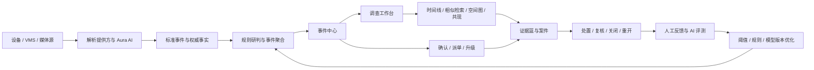
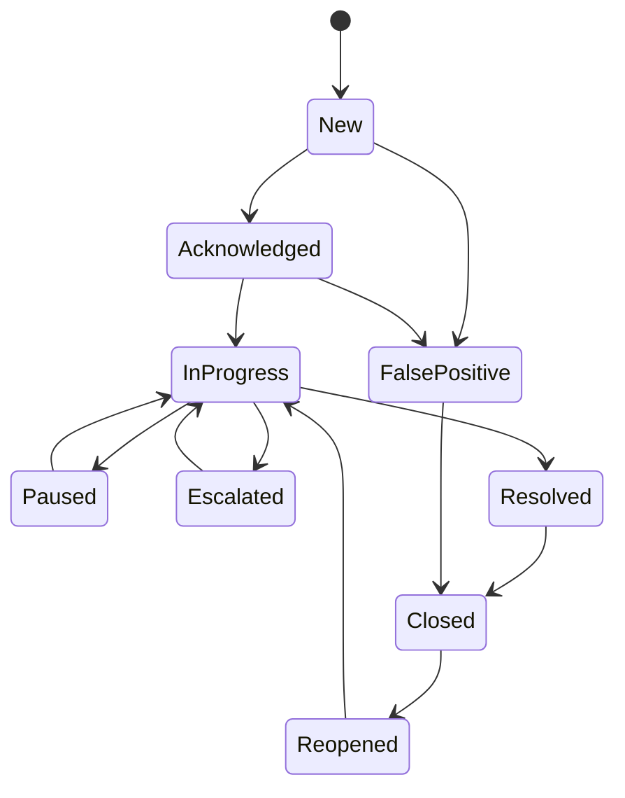

# Aura 商业产品化功能优化与扩展开发方案

> 文档版本：1.1  
> 编制日期：2026-07-23  
> 适用基线：Aura 0.2.0  
> 文档状态：评审修订稿；完成 P0 决策并取得批准后转为 Approved  
> 文档性质：产品规划、研发设计、测试验收与版本立项共同基线  
> 适用范围：前端、Aura API、AI 服务、PostgreSQL/pgvector、ArangoDB、Redis、对象存储、设备与外部媒体解析提供方  
> 优先级定义：P0 为商业上线硬门槛，P1 为核心产品闭环，P2 为差异化与规模化能力，P3 为中长期生态能力

### 文档控制

| 项目 | 责任或规则 |
| --- | --- |
| 文档所有者 | 产品负责人 |
| 技术所有者 | 后端/平台负责人、AI/数据负责人 |
| 必须评审 | 产品、设计、后端、前端、AI/数据、QA、SRE、安全、隐私/法务、实施交付 |
| 最终批准 | 产品负责人、技术负责人、安全/隐私负责人、运维交付负责人 |
| 批准条件 | P0 服务画像、数据处理边界、商业交付形态、资源计划和目标市场适用要求均已确认 |
| 变更规则 | 范围、SLO、数据用途、权限、上线门禁或支持承诺变化时，必须记录决策、影响、批准人和生效版本 |

### 修订记录

| 版本 | 日期 | 变更摘要 | 状态 |
| --- | --- | --- | --- |
| 1.0 | 2026-07-23 | 初版商业产品化优化与扩展方案 | Draft |
| 1.1 | 2026-07-23 | 补充商业交付、量化门禁、领域边界、迁移、隐私安全、追踪与批准规则 | Review |

## 1. 文档目的

本文档将 0.2.0 版本的架构成果和商业产品级检查结论转化为可开发、可排期、可测试、可验收的功能方案，解决以下问题：

1. 明确 Aura 的产品定位、目标客户、核心用户和业务边界。
2. 区分“已实现能力”“需要产品化增强的能力”和“尚未实现的能力”，避免重复建设或对外过度承诺。
3. 将告警、研判、向量检索、关系图、媒体解析和运维能力组织成连续的用户工作流。
4. 建立商业上线所需的可靠性、安全性、可观测性、AI 治理、数据治理和运维验收门槛。
5. 给出分期路线图、功能编号、依赖关系、验收标准和建议交付物，作为后续迭代的统一依据。

本文档不替代现有的[通用媒体解析与多模数据架构开发计划](通用媒体解析与多模数据架构开发计划.md)、[媒体解析平台运维手册](媒体解析平台运维手册.md)和[运维上线手册](运维上线手册.md)，而是在其工程底座之上补齐商业产品体验和业务闭环。

## 2. 执行摘要

Aura 0.2.0 已具备较完整的通用媒体解析和多模数据底座：提供方抽象、图片/视频/视频流任务、可靠 Inbox/Outbox、标准事件、pgvector 向量检索、ArangoDB 图投影、多租户权限和运行就绪检查均已落地。现阶段不应推倒重写，也不应继续以“增加更多零散 AI 接口”作为主要方向。

下一阶段最有价值的工作，是将底层能力产品化为以下三条主线：

- **上线硬门槛**：完成真实依赖环境、生产规模、故障恢复、浏览器和 Linux 交付链的验证，形成可阻断发布的质量门禁。
- **业务闭环**：把告警、研判、相似检索、图查询、证据和处置记录整合为事件/案件中心与调查工作台。
- **治理与生态**：将 AI 评测、人工反馈、模型发布、隐私合规、接入适配和用量成本变成可运营的产品能力。

建议将 Aura 的产品定义统一为：

> 面向开放式集宿区、公寓、宿舍园区及相似人员高流动场景的智能视觉解析与治理中枢。Aura 连接既有视频与第三方解析能力，将抓拍和视频事件转化为可检索的时空事实、可解释的风险线索和可审计的闭环处置结果。

## 3. 产品定位与边界

### 3.1 目标客户

- 开放式集宿区、公寓楼、宿舍园区的运营和安全管理单位。
- 需要盘活既有摄像头、NVR/VMS 和第三方算法能力的政企客户。
- 对内网部署、数据本地化、离线交付和审计追溯有明确要求的组织。
- 需要统一接入多家算法或设备提供方、降低单一厂商绑定风险的集成商。

### 3.2 核心用户

| 用户角色 | 核心任务 | 主要产品界面 |
| --- | --- | --- |
| 一线处置人员 | 接收告警、确认、核查、补充证据、反馈误报、完成处置 | 事件/案件中心、轻量处置端 |
| 研判人员 | 以图搜轨、时空串联、共现分析、关联案件、导出证据 | 调查工作台 |
| 管理人员 | 查看风险态势、SLA、处置质量、趋势和资源利用率 | 统计驾驶舱、经营报表 |
| 平台管理员 | 管理租户、角色、规则、提供方、模型、数据策略 | 平台管理中心 |
| 运维人员 | 检查健康、积压、容量、故障恢复、回放和重建 | 运行中心 |
| 算法/数据人员 | 管理评测集、阈值、模型版本、反馈和漂移 | AI 治理中心 |
| 集成实施人员 | 接入设备、媒体源和算法提供方，完成联通与验收 | 接入向导、适配器管理 |

### 3.3 产品边界

Aura 的核心职责是媒体解析控制、业务事实沉淀、检索研判、规则触发和闭环处置，不承担以下职责：

- 不建设通用 VMS，不长期代理、录制或转码全部视频流。
- 不在业务 API 内实现完整的视频编解码和通用模型训练框架。
- 不将 ArangoDB 作为业务权威库，不进行 PostgreSQL 与图数据库的同步双写。
- 不以单次 AI 结果替代人工核查，不支持完全自动化的处罚或高影响决策。
- 不将供应商私有字段直接传播到业务模型；所有接入均转换为版本化标准事件。

### 3.4 商业交付形态与支持边界

商业产品 1.0 以私有化交付为主，托管服务作为后续受限形态。任何形态只有通过对应支持矩阵和发布门禁后，才能在销售材料中标记为“已支持”。

| 交付形态 | 目标客户与拓扑 | 1.0 最低交付范围 | 可用性与支持边界 |
| --- | --- | --- | --- |
| Private Standard | 单客户、单站点、小规模设备与流；Docker Compose | 离线安装包、外部 PostgreSQL/pgvector、ArangoDB、对象存储、Redis、备份恢复、升级与回滚 | 不承诺应用层高可用；按 Standard 服务画像验收恢复能力 |
| Private HA | 中大型或关键业务客户；Kubernetes 或批准的等价集群 | 控制面/Worker 多副本、外部高可用数据服务、滚动升级、容量保护和故障转移 | 仅在 HA 演练、容量和 RPO/RTO 门禁全部通过后销售 |
| Managed Pilot | 受控托管或多租户试点 | 租户隔离、权益、计量、配额、SLO 报告、安全运营和退租销毁 | 首版不作为默认交付；必须单独完成互联网暴露面和运营值守评审 |

每个发行版必须随附支持矩阵，至少声明 Aura 版本、操作系统、CPU 架构、浏览器、PostgreSQL/pgvector、ArangoDB、Redis、对象存储、容器运行时/Kubernetes、设备型号与固件、解析提供方和保留期限。未进入矩阵的组合只能标记为试验性。

版本与支持策略：

- 商业生产版本遵循语义化版本，并为当前主版本和前一稳定次版本提供升级路径；具体支持期限写入发行说明和合同档案。
- 破坏性配置、数据或 API 变更至少提前一个稳定版本给出弃用说明、迁移工具和验证报告。
- 客户负责基础设施、网络和数据备份时，交付清单必须明确边界；Aura 负责的组件必须提供监控、恢复和升级手册。
- 产品权益使用版本化 entitlement 表达，至少包含允许模块、设备/流/用户/租户限额、有效期和支持级别，不通过客户专属代码分支实现。
- 授权到期或签名异常不得删除客户数据；受限模式、宽限期、紧急延期和恢复过程必须明确、可审计并与合同一致。

### 3.5 产品成功指标

工程门禁证明“系统能上线”，产品指标用于判断“客户能获得持续价值”。首个商业试点必须建立下列基线并在 R1/R2 退出评审中复盘：

| 指标 | 商业产品 1.0 候选目标 | 数据来源 |
| --- | --- | --- |
| 首次价值时间 | 基础设施、设备和授权就绪后，标准接入向导在 1 个工作日内产生首条可处置业务事件 | 接入验收记录、审计事件 |
| 主流程成功率 | 标准角色完成“事件查看—确认—派单—案件关闭”任务的成功率不低于 95% | 可用性测试、产品分析事件 |
| 事件闭环覆盖率 | 需要处置的事件 100% 可关联活动记录和最终结论 | 事件/案件数据库与审计 |
| 证据完整率 | 关闭时要求证据的案件，清单、哈希、来源和操作者完整率为 100% | 证据包校验报告 |
| 接入稳定性 | 认证适配器标准验收套件首次执行通过率不低于 95%，其余失败均有稳定错误码和诊断建议 | 接入向导报告 |
| 误报反馈闭环 | 被标记为误报的事件 100% 记录原因、规则/模型版本和复核状态 | 反馈与 AI 治理记录 |
| 升级成功率 | 支持矩阵内的标准升级、验证和回滚用例 100% 通过 | 发布验收报告 |
| 支持负担 | 试点期按接入、权限、性能、设备、AI 质量分类统计工单并形成前五原因改进计划 | 工单与版本复盘 |

### 3.6 关键决策记录

| 编号 | 决策事项 | 当前基线 | 最晚批准点 |
| --- | --- | --- | --- |
| DEC-001 | 首发交付形态 | Private Standard 为必交，Private HA 通过演练后开放，Managed Pilot 受限 | R0 开始前 |
| DEC-002 | 业务事件与案件权威边界 | 业务事件负责发现与聚合，案件负责跨事件协同处置；二者不共享可写状态 | CASE/EVT 详细设计前 |
| DEC-003 | 历史无租户数据处理 | 禁止自动归入默认租户；进入隔离清单，由业务负责人确认、归档或删除 | 数据迁移执行前 |
| DEC-004 | AI 反馈数据用途 | 默认仅在原租户、原目的范围内用于评测；训练或跨租户使用必须单独批准 | AIG-01 设计前 |
| DEC-005 | 企业身份能力 | OIDC 与 MFA 纳入商业生产基线；LDAP/AD 通过 OIDC 联邦优先，直连按客户项目评估 | R0 范围冻结前 |
| DEC-006 | API 版本策略 | 新产品域采用 `/api/v1`，旧 `/api/*` 在声明的兼容窗口内保留 | EVT/CASE API 冻结前 |

## 4. 当前基线与成熟度判断

### 4.1 已实现且应复用的能力

- 通用媒体解析提供方、流水线、媒体源、流订阅和异步任务管理。
- HMAC、Bearer、OAuth2 Client Credentials、mTLS 等提供方认证方式。
- Webhook 持久化 Inbox、幂等去重、乱序处理、重试与死信重放。
- PostgreSQL 权威业务事实、pgvector 512 维向量与 HNSW 索引。
- PostgreSQL Outbox 到 ArangoDB 的可重建图投影。
- 人员访问、共现、房间人员、摄像头可达性和路径等图查询 API。
- 租户角色范围、媒体分析细分权限、图查询和图管理权限。
- 告警列表、基础告警闭环表和扩展管理页。
- AI 检索指标、离线评测接口、A/B 实验配置和向量影子评测。
- Docker Compose、数据库迁移、readiness、CI 安全扫描和离线部署脚本。

### 4.2 需要产品化增强的能力

| 方向 | 当前状态 | 商业产品级缺口 | 结论 |
| --- | --- | --- | --- |
| 告警闭环 | 已有 `alert_workflow`、更新接口和扩展页 | 与告警列表分离；缺少当前态、活动时间线、SLA、证据、评论、关联和批量操作 | 在现有基础上升级为事件/案件中心 |
| 调查研判 | 已有向量检索、轨迹、图路径和共现 API | 能力分散，缺少统一时间线、地图、关系图和证据篮 | 新建调查工作台，不重做底层引擎 |
| AI 评测 | 已有 Recall/Precision/MRR/延迟计算和影子评测 | 运行结果未形成持久历史；缺少标注反馈、发布门禁、漂移和回滚闭环 | 新建 AI 治理中心和持久化模型 |
| 运行运维 | 已有 readiness、Worker 心跳、Inbox/Outbox 和重放操作 | 缺少 SLO 趋势、容量预测、变更保护和生产规模证据 | 升级为运行中心并加入发布门禁 |
| 接入配置 | 已有提供方/流水线/媒体源表单和连通测试 | 配置依赖专业知识；缺少端到端向导、样例验证和适配器认证 | 新建接入向导和适配器生命周期 |
| 规则研判 | 已有 ROI、定时研判和场景逻辑 | 缺少版本化、可回测、可灰度的低代码规则产品面 | 建设规则与自动化中心 |
| 数据安全 | 已有 RBAC、租户隔离、审计和安全扫描 | 缺少留存策略、隐私遮挡、法律保全、证据水印和导出链路追踪 | 建设数据治理与证据能力 |
| 商业运营 | 已有租户和角色范围 | 缺少套餐权益、配额、用量、成本归集和租户级服务报表 | 作为多租户/商业化 P2 能力建设 |

### 4.3 尚未完成或需要更正口径的能力

- 真实厂商 C++ SDK 接入尚未实现，应以[C++SDK 对接接口契约与待接入点](C++SDK对接接口契约与待接入点.md)为准。
- ONVIF 和大华相关前端动作当前仍为预留，不能在对外材料中标记为“已支持”。
- 当前主要设备能力以海康 ISAPI 为基线，其他品牌必须经过真实设备和兼容矩阵验收后再升级产品状态。
- 0.2.0 发布记录明确列出的真实 ArangoDB、目标浏览器、Linux 脚本和生产规模压测仍属于发布前必补项。

产品文档、销售材料和界面应统一使用以下状态标签：`已支持`、`试验性`、`计划中`、`已弃用`。只有通过对应版本验收的能力才能标记为“已支持”。

## 5. 同类领先产品与先进理念对标

### 5.1 对标结论

| 对标对象或标准 | 领先理念 | 对 Aura 的落地要求 |
| --- | --- | --- |
| Genetec Security Center | 统一平台、开放生态、事件上下文和统一操作体验 | 将设备、提供方、告警、调查和响应集中到连续工作流；形成适配器认证机制 |
| Milestone XProtect | 开放平台、广泛设备与第三方应用、可扩展部署 | 固化适配器契约、兼容矩阵、版本生命周期和开发者交付物 |
| BriefCam | Review、Respond、Research 三类产品闭环 | 将 Aura 能力组织为“调查、响应、洞察”三个用户视角，而非技术菜单集合 |
| AWS Rekognition | 图片、存储视频、流事件、可搜索媒体库和规模化 API | 保持图片/视频/流统一任务模型，补充批量、成本、配额和服务质量指标 |
| Azure AI Video Indexer | 云边协同、多模洞察、自然语言检索和可定位到片段的结果 | 在 P2 引入受控的自然语言查询，并要求结果返回结构化条件和证据定位 |
| NIST AI RMF | Govern、Map、Measure、Manage 的持续 AI 风险治理 | 建立模型登记、评测、人工反馈、发布审批、持续监测和回滚 |
| OpenTelemetry | 厂商中立的 traces、metrics、logs 与上下文传播 | 统一 API、AI、提供方、Inbox、Outbox、向量和图查询的 trace 关联 |
| OWASP API Security Top 10 | 对象级授权、资源消耗、SSRF、第三方 API 消费等风险 | 将租户对象授权、请求上限、出站 URL 策略和管理操作保护纳入发布门禁 |
| pgvector | ANN 的速度/召回权衡、过滤后召回、迭代扫描和多租户影响 | 以生产数据持续测量 Recall@K、延迟和租户过滤效果，不能只验证索引存在 |

### 5.2 参考资料

- [Genetec Security Center](https://www.genetec.com/products/unified-security/security-center)
- [Genetec Security Center Ecosystem](https://www.genetec.com/products/unified-security/security-center/ecosystem)
- [Milestone XProtect](https://www.milestonesys.com/products/software/xprotect/)
- [Milestone BriefCam](https://www.milestonesys.com/products/software/briefcam/)
- [Amazon Rekognition Developer Guide](https://docs.aws.amazon.com/rekognition/latest/dg/what-is.html)
- [Azure AI Video Indexer](https://learn.microsoft.com/en-us/azure/azure-video-indexer/)
- [NIST AI Risk Management Framework](https://www.nist.gov/itl/ai-risk-management-framework)
- [OpenTelemetry Documentation](https://opentelemetry.io/docs/)
- [OWASP API Security Top 10](https://owasp.org/API-Security/)
- [pgvector](https://github.com/pgvector/pgvector)

## 6. 产品设计原则

1. **以任务为中心**：用户界面围绕接入、发现、调查、处置、复盘组织，不围绕数据库和中间件组织。
2. **人机协同**：AI 输出风险线索、相似候选和解释依据，最终确认、误报反馈和高影响处置由授权人员完成。
3. **权威事实唯一**：PostgreSQL 保存业务当前态和不可抵赖的活动记录；pgvector 与 ArangoDB 分别承担检索和派生关系。
4. **可追溯优先**：每条告警、规则命中、模型输出、人工修改、导出和管理操作均可追到租户、用户、时间、模型和数据来源。
5. **渐进式开放**：先固化标准契约和接入向导，再扩展厂商适配；私有 SDK 通过隔离网关接入。
6. **默认安全**：最小权限、密钥引用、出站地址控制、请求大小限制、二次确认、数据最小化和默认脱敏。
7. **可降级与可恢复**：外部提供方、向量库或图数据库异常不得破坏权威写入；恢复后可追平或重建。
8. **用证据发布**：性能、召回、恢复和兼容性以版本化报告为准，不以本地冒烟测试替代生产门禁。

## 7. 目标业务闭环



系统必须保证从“发现风险”到“完成处置”可以在同一租户范围内闭环，并能回答：谁发现、依据是什么、谁处理、何时处理、结果如何、是否误报、后续是否复发。

## 8. 功能总体规划

| 编号 | 功能域 | 版本优先级 | 建议阶段 | 核心价值 |
| --- | --- | --- | --- | --- |
| OPS-01 | 商业上线门禁与压测包 | P0 | R0 | 防止测试环境成功、生产环境失效 |
| OPS-02 | 运行中心与 SLO | P0/P1 | R0-R1 | 让运维可发现、可定位、可恢复 |
| OPS-03 | 高风险管理操作保护 | P0 | R0 | 防止误重放、误重建和重复副作用 |
| DOC-01 | 能力状态与文档口径治理 | P0 | R0 | 避免错误承诺和交付争议 |
| EVT-01 | 统一事件中心 | P1 | R1 | 形成一线人员的主要工作入口 |
| CASE-01 | 案件与处置闭环 | P1 | R1 | 将零散告警升级为可审计业务成果 |
| INV-01 | 调查工作台 | P1 | R1-R2 | 把向量、轨迹、图和空间能力转为研判效率 |
| INT-01 | 提供方与媒体源接入向导 | P1 | R1 | 降低实施成本和配置错误 |
| INT-02 | 设备/适配器生态与认证 | P1/P2 | R2-R3 | 降低厂商绑定，扩大可交付范围 |
| RULE-01 | 规则与自动化中心 | P1 | R2 | 快速适配不同园区业务规则 |
| AIG-01 | AI 治理与反馈中心 | P1 | R2 | 可测量、可审批、可回滚地使用 AI |
| DATA-01 | 数据生命周期与容量治理 | P1 | R1-R2 | 控制长期存储成本与查询退化 |
| MIG-01 | 告警/工作流到事件案件迁移 | P1 | R1 | 建立单一权威状态并保障历史数据可追溯 |
| SEC-01 | 隐私、数据使用、证据与合规 | P0/P1 | R0-R2 | 先确定处理边界，再交付敏感数据与正式取证能力 |
| SEC-02 | 企业身份与高权限保护 | P0/P1 | R0-R1 | 支撑企业身份、MFA、step-up 和应急访问 |
| NTF-01 | 通知、升级与外联编排 | P1/P2 | R2 | 缩短响应时间并接入客户流程 |
| BI-01 | 运营分析与管理驾驶舱 | P2 | R2-R3 | 衡量风险、处置质量和资源效果 |
| NLP-01 | 受控自然语言调查 | P2 | R3 | 降低复杂检索门槛，提高调查效率 |
| COM-01 | 租户权益、配额、用量与成本 | P2 | R3 | 支撑 SaaS、托管服务和内部成本核算 |
| MOB-01 | 轻量移动处置端 | P2 | R3 | 支撑现场核查、拍照取证和快速反馈 |

## 9. P0 商业上线硬门槛

### 9.0 P0 服务画像与量化口径

任何 P0 测试开始前，产品、技术、SRE 和交付负责人必须批准版本化服务画像。画像既是容量与报价输入，也是发布门禁；测试后只能通过正式变更记录调整，禁止为使失败结果通过而追溯降低阈值。

服务画像至少记录：

- 交付形态、环境编号、Aura/依赖版本、镜像摘要、迁移版本和配置指纹。
- CPU、内存、磁盘、网络、GPU（如有）、节点/副本数量和存储性能。
- 租户、设备、活跃流、并发用户、日事件、峰值事件、向量、图节点/边和媒体容量。
- 常态、峰值、5 倍突发、下游故障和恢复追平五类负载，以及测试数据版本和生成方法。
- API、事件链路、向量、图、导出和后台任务各自的延迟、吞吐、正确性、资源和失败阈值。
- 数据备份责任方、备份频率、恢复顺序、RPO/RTO、维护窗口和外部提供方依赖边界。

| 交付形态 | 核心 API 月度运行目标 | PostgreSQL/对象元数据 RPO | 整体业务恢复 RTO | 说明 |
| --- | --- | --- | --- | --- |
| Private Standard | 运行 SLO 99.5%；不作为应用 HA 承诺 | 不高于 15 分钟；无法持续归档日志时必须在合同中降级披露 | 不高于 4 小时 | 单站点恢复；批准的维护窗口单独统计 |
| Private HA | 不低于 99.9% | 不高于 5 分钟 | 不高于 60 分钟 | 必须在目标拓扑完成节点、数据库和对象存储故障转移演练 |
| Managed Pilot | 不低于 99.9% | 不高于 5 分钟 | 不高于 60 分钟 | 另需值守、互联网暴露面、租户隔离和退租演练 |

ArangoDB 是可重建投影，不定义独立数据 RPO；目标规模下从 PostgreSQL 权威数据全量重建并恢复常用查询的时间不得超过服务画像批准值，默认候选值为 2 小时。无法满足上述候选值的交付必须降低产品形态或取得带到期日的例外批准。

### 9.1 OPS-01 商业上线门禁与压测包

#### 目标

将 0.2.0 发布记录中的未完成环境项变成 CI/CD 或发布审批中的阻断门禁，所有结果形成可归档报告。

#### 功能要求

1. 测试开始前校验已批准的服务画像版本；缺少画像、数据集、目标硬件或阈值时直接 `blocked`。
2. 建立真实 ArangoDB 3.12 集成环境，验证初始化、幂等投影、断点追平、全量重建、N 跳查询和最短路径。
3. 在生产同版本 PostgreSQL + pgvector 上执行不同数据规模的 Recall@K、P50/P95/P99 延迟、吞吐和内存测试。
4. 执行 Inbox/Outbox 峰值积压、Worker 中断、数据库短暂不可用、提供方 429/500/超时和恢复追平测试。
5. 在目标 Chromium/Edge 版本及约定的窄屏分辨率执行关键页面视觉与交互回归。
6. 在 Linux 构建机执行镜像构建、推送、保存和离线包脚本。
7. 每次候选发布生成机器可读 JSON 和人工可读 Markdown/PDF 报告，记录服务画像版本、构建版本、环境、数据规模、参数和结论。
8. 未达到任一硬门槛时，发布状态必须为 `blocked`；例外必须说明影响、补偿措施、责任人、批准人和不超过 30 天的关闭日期。

#### 建议测试矩阵

#### 基线命令与证据

仓库已有脚本只作为可重复的基础证据；`full-check` 是联调 smoke，不替代目标规模压测、真实 ArangoDB、备份恢复、浏览器和 Linux 交付门禁：

```powershell
dotnet test Aura.sln -c Release
python -m pytest
npm --prefix frontend run lint
powershell -ExecutionPolicy Bypass -File .\scripts\ops\aura-ops.ps1 readiness
powershell -ExecutionPolicy Bypass -File .\scripts\ops\aura-ops.ps1 full-check
powershell -ExecutionPolicy Bypass -File .\scripts\ops\aura-ops.ps1 db-status
```

每条命令必须保存退出码、提交号、环境变量清单（不含秘密）、日志摘要和产物路径；生产门禁还必须附加服务画像对应的压测、故障注入、恢复和安全/隐私报告。
| 测试类别 | 最低场景 | 必须记录的指标 |
| --- | --- | --- |
| 向量检索 | 10 万、100 万、目标生产规模；含租户和模型过滤 | Recall@1/5/10、P95/P99、QPS、索引大小、CPU/内存 |
| 图查询 | 目标规模节点/边；深度 2/4/8；最短路径 | P95/P99、超时率、扫描规模、资源使用 |
| 事件链路 | 常态、5 倍突发、1 小时下游故障 | 接收率、重复副作用数、最大积压、追平时间、死信率 |
| 提供方故障 | 429、500、超时、慢响应、非法响应、断网 | 重试次数、熔断时间、恢复时间、业务写入完整性 |
| 前端回归 | 桌面、1366 宽、窄屏；各权限角色 | 遮挡、溢出、空态、错误态、权限隐藏、键盘可用性 |
| 离线交付 | 全新主机和升级主机 | 镜像完整性、迁移状态、启动时长、回滚步骤 |

#### 验收标准

- 真实 ArangoDB 验收无阻断缺陷，权威数据可重建图投影。
- 100 次重复事件仍只产生一次业务副作用。
- 所有失败注入均有明确告警、可诊断原因和经过验证的恢复路径。
- Recall@K、性能、可用性和恢复结果必须满足测试前批准的服务画像；负责人只能确认结果，不能在测试后追溯降低阈值。
- 报告与构建制品绑定，可追溯到 Git commit、镜像 digest 和数据库迁移版本。

### 9.2 OPS-02 运行中心与 SLO

#### 目标

把现有 readiness 页面升级为面向值班运维的运行中心，能够回答“是否可用、哪里变慢、积压是否扩大、何时能恢复”。

#### 功能要求

- 提供 API、AI、解析提供方、流订阅、Inbox、Outbox、pgvector、ArangoDB、对象存储和通知通道的统一健康视图。
- 展示 5 分钟、1 小时、24 小时和 7 天趋势，而非只展示当前值。
- 支持按租户、提供方、流水线、Worker 实例和错误类别下钻。
- 建立 SLI：可用率、请求延迟、错误率、事件端到端延迟、积压深度、死信率、向量检索延迟、图查询延迟。
- 建立 SLO 与错误预算，支持阈值告警、静默窗口、维护窗口和告警恢复通知。
- 统一传播 `trace_id`，将提供方请求、Inbox、业务事实、Outbox、AI 检索和图查询关联起来。
- 提供最近变更信息，包括版本、配置变更、模型切换和规则发布，以辅助故障定位。

#### 初始 SLO 建议

以下是商业产品 1.0 候选门槛。R0 开始前必须写入服务画像并批准；真实硬件用于确认容量和推荐规格，不得在测试后随意降低服务质量门槛。

计算口径：

- 核心 API 可用率 = 成功响应的合格请求数 / 合格请求总数。合格请求指已到达 Aura 且通过基本协议校验的请求；Aura 5xx、超时和因平台容量触发的 429 计为失败，客户鉴权/参数错误和明确的租户配额拒绝不计入。
- 批准并提前通知的维护窗口单独报告；未批准维护、发布故障和观测缺失均不得从分母中删除。
- 外部解析提供方的可用性单独计算，但 Aura 的超时、重试、降级和已接收事实持久化仍计入 Aura SLO。
- 延迟按服务端接收到完成响应计算，按接口族分别统计；样本不足、直方图桶不覆盖阈值或缺少 trace 时门禁失败。
- 各租户、全局和交付形态同时计算；全局达标不能掩盖单一租户持续不可用。

| 指标 | 商业产品 1.0 候选门槛 |
| --- | --- |
| 核心 API 月可用率 | Private Standard 运行 SLO 不低于 99.5%；Private HA/Managed Pilot 不低于 99.9% |
| 已进入 Aura 的标准事件持久化成功率 | 不低于 99.99%；确认持久化后不得因下游故障丢失 |
| Webhook 持久化应答 P95 | 不高于 300 ms，不含客户端网络传输 |
| 标准事件到权威业务事实写入 P95 | 不高于 5 s，不含外部算法处理时间 |
| 向量检索质量与延迟 | 对固定精确基线 Recall@10 不低于 0.95，且目标规模/标准过滤下 P95 不高于 500 ms |
| 常用图查询 P95 | 不高于 1 s；查询模板、最大深度和数据规模写入服务画像 |
| 1 小时下游故障后的积压恢复 | 依赖恢复后 30 分钟内追平，死信在批准阈值内，重复业务副作用为 0 |
| 高风险重放与迁移 | 相同幂等键重复提交不创建第二个任务，100 次相同业务事件只产生一次副作用 |

运行中心根据统计窗口自动计算错误预算。预算消耗达到 50%/75%/100% 时分别触发预警、发布收紧和非必要变更冻结；恢复发布必须有事故结论和负责人批准。

### 9.3 OPS-03 高风险管理操作保护

#### 适用操作

- Inbox 死信批量重放。
- 媒体制品死信重放。
- Outbox 死信重放。
- ArangoDB 全量重建。
- 向量回填、迁移重启和读写模式切换。
- 批量停用流订阅、提供方或规则。

#### 功能要求

1. 操作前展示影响范围预览：租户、记录数、时间范围、目标状态、潜在副作用和预计耗时。
2. 要求二次确认；高影响操作要求输入确认短语或工单号。
3. 支持 dry-run，仅返回将受影响的对象，不修改状态。
4. 生成不可变操作记录，包含操作者、权限、请求参数摘要、开始/结束时间、结果和 trace。
5. 重放请求必须有幂等键，避免浏览器重试或重复点击导致多次提交。
6. 长任务返回任务 ID，支持进度、取消条件、失败原因和完成通知。
7. 默认限制单次批量大小；扩大上限需要更高权限。

#### 验收标准

- 未完成影响预览和确认时不能执行高风险操作。
- 同一幂等键重复提交不会创建第二个任务。
- 越权租户、对象或操作返回 403，并留下安全审计记录。
- 操作失败后可判断已处理范围和未处理范围，不出现状态不明。

### 9.4 DOC-01 能力状态与文档口径治理

- 建立唯一的能力矩阵，字段包括功能、版本、状态、适配对象、限制、验收报告和负责人。
- README、建设方案、销售材料、前端标签和 API 文档由能力矩阵派生或定期校验。
- 将 ONVIF、大华、真实 C++ SDK 等未完成能力标为“计划中”或“试验性”。
- CI 增加文档链接和契约文件有效性检查；发布时校验版本号和能力状态。
- 每个适配器必须提供真实设备型号、固件版本、协议能力和已知限制。

## 10. P1 核心产品闭环

### 10.1 EVT-01 统一事件中心

#### 目标

将告警列表、解析事件和研判结果按业务语义聚合为统一事件入口，一线用户无需在多个技术页面之间切换。运行异常继续由运行中心负责，除非经过版本化业务规则显式转换为业务事件。

#### 权威领域边界

| 对象 | 权威存储与职责 | 允许的可写状态 | 禁止事项 |
| --- | --- | --- | --- |
| 提供方事件/Inbox | `media_analysis_inbox`；接收、验签、去重、乱序和重试 | 传输处理状态 | 不直接承载业务处置状态 |
| 标准解析事件 | `media_analysis_event`；保存版本化解析事实 | 只追加事实和处理结果 | 不被人工覆盖为案件结论 |
| 业务事件 | `business_event`；聚合规则命中并承担分诊 | `open`、`acknowledged`、`dismissed`、`linked` | 不保存案件处理进度、解决结论或案件 SLA 当前态 |
| 案件 | `incident_case`；承担跨事件协同、处置、证据、复核和解决 SLA | 案件状态机定义的状态 | 不反向改写标准解析事实 |
| 运行异常 | 运行中心的告警/事故对象 | 运维状态 | 默认不得混入客户业务事件和业务 SLA |

事件中心可以组合展示业务事件及其关联案件的只读投影，但命令必须路由到权威对象：分诊、确认和驳回写业务事件；派单、处理、暂停、解决、关闭和重开写案件。二者通过 `incident_case_event` 关联，不复制可写当前态。

#### 页面结构

- 顶部：待分诊、已确认、已关联案件、案件即将超时、今日解决和误报率等指标；案件指标来自只读投影。
- 左侧筛选：租户/项目、楼栋、楼层、摄像头、事件类型、严重级别、分诊状态、分诊人、案件状态、时间范围、规则和模型版本。
- 中部列表：缩略图、事件摘要、地点、时间、置信度、重复次数、分诊状态和关联案件摘要。
- 右侧详情：媒体证据、规则命中解释、相似事件、人员/轨迹关系、事件活动和关联案件入口。
- 支持保存筛选视图、批量确认、批量分诊、按原因驳回、创建/关联案件和受控导出。
- 支持实时新增提示，但不得因新事件插入导致用户正在查看的列表跳动。

#### 事件聚合与数据模型

- 原始解析事件不直接等于业务事件。
- 同一租户、规则、实体、空间范围和时间窗口内的重复命中可聚合为一个事件并累计 occurrence。
- 聚合键至少包含 `tenant_id`、规则版本、实体/候选实体、空间范围和时间窗口版本；必须以数据库唯一约束或等价幂等机制保证。
- 聚合策略必须版本化，保留首次、最近一次和代表性证据。
- `dismissed` 事件再次命中时，按策略创建新事件或生成显式 reopen 活动；已关联案件的事件不得静默脱离案件。
- 系统必须保留从业务事件到标准事件、Inbox 和提供方事件的追溯链。

| 表 | 用途 | 关键约束 |
| --- | --- | --- |
| `business_event` | 业务事件当前态 | `tenant_id` 非空；事件号租户内唯一；聚合键唯一；包含策略版本和乐观锁 `version` |
| `business_event_source` | 业务事件与标准事件关系 | `(tenant_id, business_event_id, analysis_event_id)` 唯一，只追加 |
| `business_event_activity` | 确认、分诊、驳回、重开和关联记录 | 包含前后状态、原因、操作者、`trace_id` 和幂等键，只追加 |
| `incident_case_event` | 案件与业务事件关系 | 同租户外键；重复关联幂等；解除关联生成活动而非删除历史 |

#### 建议 API

| 方法 | 路径 | 用途 |
| --- | --- | --- |
| `GET` | `/api/v1/events` | 分页、组合筛选和稳定排序 |
| `GET` | `/api/v1/events/{id}` | 事件详情、来源和关联案件投影 |
| `POST` | `/api/v1/events/{id}/acknowledge` | 确认事件 |
| `POST` | `/api/v1/events/batch-triage-assign` | 批量分配分诊人 |
| `POST` | `/api/v1/events/{id}/dismiss` | 按分类原因驳回或标记误报 |
| `GET` | `/api/v1/events/{id}/timeline` | 事件活动和来源时间线 |
| `POST` | `/api/v1/events/{id}/cases` | 创建案件或建立案件关联 |

#### 验收标准

- 用户可在三个操作以内完成“查看详情、确认、创建或关联案件”。
- 所有事件状态变化均形成活动记录；当前态可由活动记录重放校验。
- 事件页面显示的案件状态来自案件服务投影，事件接口不能直接更新案件状态。
- 组合筛选、分页和租户授权在批准的服务画像下达到 API 性能门槛。
- 批量操作部分失败时返回逐项结果，不得全部显示成功。

### 10.2 CASE-01 案件与处置闭环

#### 现有能力复用

`alert_record` 和 `alert_workflow` 仅作为兼容来源，不再接收新产品域的权威写入。迁移过程把可确认归属的 workflow 记录转换为业务事件和案件活动；无法确认租户、用户或状态的记录进入隔离清单，不自动归入默认租户。

#### 案件状态机



所有转换必须经过服务端状态机校验并生成只追加活动。`Paused` 必须记录批准的暂停原因、开始时间和恢复人；`Closed` 后只有 `case.review` 或更高权限可以重开；误报必须填写分类原因；紧急案件关闭可配置双人复核。合并、拆分和解除关联不通过直接改写历史实现，而是生成新案件/关联和可追溯活动。

#### 功能要求

- 从一个或多个业务事件创建案件，也可将后续事件关联到已有案件；所有关联必须同租户。
- 支持负责人、协办人、组织、优先级、标签、截止时间、升级级别和关注人。
- 支持评论、处置步骤、附件、现场照片、外部工单号和结构化处置结论。
- 提供活动时间线，区分系统事件、AI 结果、人工操作和外部系统回执。
- 支持版本化 SLA：确认、开始处理和解决时限，批准的暂停条件、累计暂停时长和超时升级。
- 支持重复案件合并、错误关联解除、案件拆分和关联关系说明，并保持原案件号和活动可查询。
- 支持案件模板，不同事件类型可预置处置清单、必填证据和复核要求。
- 支持证据包导出，导出前校验对象级权限、用途、脱敏和法律保全策略。

#### 建议数据模型

| 表 | 用途 | 关键字段或约束 |
| --- | --- | --- |
| `incident_case` | 案件唯一当前态 | `tenant_id` 非空、`case_no` 租户内唯一、`status`、`status_reason`、`priority`、`owner_user_id`、SLA 策略版本/时间、累计暂停时长、`version` |
| `incident_case_event` | 案件与业务事件多对多关系 | 同租户复合外键；`(case_id, event_id, relation_type)` 唯一；关联/解除活动化 |
| `incident_case_activity` | 只追加活动流 | `activity_type`、前后状态、原因、操作者 ID/显示名快照、`trace_id`、幂等键 |
| `incident_case_comment` | 评论与内部协作 | `visibility`、`content`、`author_user_id`、编辑/删除补偿活动 |
| `incident_case_evidence` | 证据引用与完整性 | 对象存储键、哈希、媒体类型、来源、脱敏版本、保全状态和用途 |
| `incident_case_participant` | 负责人、协办和关注人 | `role_type`、`user_id`、加入/移除时间；同一有效角色关系唯一 |
| `legacy_case_migration_map` | 旧记录到新对象的迁移映射 | 旧表/旧 ID、新对象 ID、迁移批次、结果、原因和校验摘要 |

所有业务表必须包含非空 `tenant_id`；用户关系使用稳定用户 ID，显示名称仅作历史快照。当前态更新使用乐观并发控制，案件当前态只能通过案件命令 API 修改。

#### 建议 API

- `GET /api/v1/cases`：按权限分页查询案件。
- `POST /api/v1/cases`：从业务事件创建案件，要求 `Idempotency-Key`。
- `GET /api/v1/cases/{id}`：读取案件当前态、权限裁剪摘要和 ETag。
- `POST /api/v1/cases/{id}/transitions`：提交状态转换、原因和期望版本。
- `POST /api/v1/cases/{id}/events`：幂等关联或解除业务事件。
- `POST /api/v1/cases/{id}/comments`：添加具有可见级别的评论。
- `POST /api/v1/cases/{id}/evidence`：添加受控证据引用。
- `GET /api/v1/cases/{id}/timeline`：读取只追加活动时间线。

#### 验收标准

- 案件的当前状态可由活动记录重放验证。
- SLA 超时可触发升级和通知，暂停与恢复均有依据。
- 无权用户不能查看案件摘要、缩略图、导出结果或通过 ID 猜测访问。
- 删除原始媒体时，处于法律保全的证据不得被生命周期任务清除。

### 10.3 INV-01 调查工作台

#### 目标

把已有的相似检索、抓拍、轨迹、空间、共现和图路径能力组织为统一研判体验。

#### 核心布局

- **查询区**：上传图片、选择已有抓拍、人员/虚拟身份、时间范围、楼栋楼层、摄像头、相似度阈值。
- **时间线**：按时间展示抓拍、门禁/外部事件、告警、案件活动和视频片段定位。
- **空间区**：2D 楼层图为主，按需切换 3D；展示摄像头、轨迹、ROI 和停留热区。
- **关系区**：展示人员、房间、摄像头、事件和案件关系；支持共现、访问和候选路径。
- **证据篮**：用户可选择抓拍、片段、关系路径和备注，统一加入案件或导出。

#### 功能要求

1. 所有查询条件生成可复制的调查快照，记录查询时间、模型、阈值、过滤条件和结果版本。
2. 相似检索结果必须显示分数、模型版本、原图质量和时间地点，不只显示候选头像。
3. 支持从任一结果反向扩展：查看前后时间、同地点、同轨迹、共现人员和相关案件。
4. 图路径结果显示每条边的业务依据和发生时间，避免把推导关系误当作确认事实。
5. 支持保存调查、恢复上次状态、共享给同租户授权人员。
6. 证据篮中的项目使用引用和哈希，不复制业务记录；导出时再生成受控制品。
7. 长查询可取消；超时应返回部分结果和明确状态，不阻塞整个页面。

#### 建议 API

- `POST /api/v1/investigations`
- `GET /api/v1/investigations/{id}`
- `POST /api/v1/investigations/{id}/queries`
- `GET /api/v1/investigations/{id}/timeline`
- `GET /api/v1/investigations/{id}/graph`
- `POST /api/v1/investigations/{id}/evidence`
- `POST /api/v1/investigations/{id}/attach-to-case`

#### 验收标准

- 从一张图片发起相似检索并把结果关联到案件的主流程无需离开工作台。
- 查询快照可在相同数据版本和参数下复现；无法复现时说明数据或模型变化。
- 所有图关系、AI 候选和人工确认在视觉上有明确区分。
- 目标规模下，首屏先返回基础结果，图扩展和媒体加载可渐进完成。

### 10.4 INT-01 提供方与媒体源接入向导

#### 向导步骤

1. 选择接入类型：标准 HTTP 提供方、设备/VMS、文件上传或对象存储。
2. 配置地址与密钥引用，执行 DNS、网络、TLS、认证和出站策略检查。
3. 自动发现能力与协议版本，展示 Aura 支持和不支持的能力差异。
4. 创建或映射流水线，校验输入类型、模型版本和向量维度。
5. 配置媒体源，测试 Aura、提供方和媒体源之间的实际可达性。
6. 发送样例图片/视频或启动测试流，验证任务、回调签名、标准化和制品获取。
7. 展示端到端验收结果，确认后启用；失败时保留诊断报告。

#### 功能要求

- 密钥只保存引用，不在页面回显明文。
- 能力发现结果带缓存时间和刷新操作；提供方能力变化需产生配置告警。
- 对公网/内网地址、重定向和本地地址执行 SSRF 策略校验。
- 启用前必须通过最小样例，管理员可按受控流程豁免并填写原因。
- 支持导出不含密钥的接入配置包，用于测试、预生产和生产环境迁移。
- 支持连接配置版本和回滚，记录修改前后差异。

#### 验收标准

- 标准提供方可以在向导内完成从配置到标准事件入库的闭环测试。
- 任何一步失败均显示可操作原因，而非只显示 HTTP 状态码。
- 无管理权限用户只能查看脱敏状态，不能测试、修改或启用连接。

### 10.5 DATA-01 数据生命周期与容量治理

#### 功能要求

- 为标准事件、Inbox、Outbox、抓拍、告警、案件活动、审计和 AI 评测分别配置在线留存、归档留存和删除策略。
- 大表按时间并结合租户访问模式实施分区；具体分区键以压测和查询计划为依据。
- 原始媒体、缩略图、脱敏媒体、证据制品分层存储，采用独立生命周期策略。
- 提供容量仪表板：记录数、日增量、对象存储占用、向量索引大小、图节点/边数量和预计耗尽时间。
- 清理任务支持 dry-run、批次限制、断点续作、失败重试和删除审计。
- 删除业务记录时同步生成派生索引删除事件；图和向量删除失败可重放。
- 法律保全、案件证据和审计冻结优先于普通留存策略。

#### 验收标准

- 对任一数据类型可以回答保留多久、存在哪里、由什么任务删除、谁修改过策略。
- 百万级以上事件数据的常用查询不会因历史数据持续增长而无界退化。
- 清理过程中断后可安全恢复，不重复删除、不遗漏符合条件的数据。

## 11. P1/P2 智能治理与自动化

### 11.1 RULE-01 规则与自动化中心

#### 目标

将分散在代码和配置中的场景研判升级为版本化、可回测、可灰度、可解释的规则产品。

#### 规则能力

- 条件：时间段、星期、人员类型、出现次数、停留时长、空间/ROI、设备、相似度、轨迹、共现、案件历史和外部标签。
- 聚合：按人员、房间、楼层、摄像头、租户或自定义窗口聚合。
- 动作：创建事件、更新案件、通知、调用 Webhook、添加标签、进入人工复核队列。
- 噪声控制：抑制窗口、去重键、合并窗口、白名单、冷却时间和最大触发频率。
- 生命周期：草稿、待审批、灰度、已发布、暂停、已归档。
- 版本：每次修改生成新版本，保留创建人、审批人、差异和生效时间。

#### 必备安全机制

- 发布前使用历史数据 dry-run，展示预计事件量、受影响对象和与当前版本的差异。
- 支持影子运行，只记录命中而不产生告警或通知。
- 支持按租户、楼栋或设备分组灰度。
- 超过事件量阈值自动熔断规则并通知管理员。
- 规则解释必须随事件保存，包含命中的条件、窗口和输入事实引用。

#### 验收标准

- 非开发人员可通过结构化表单创建典型的滞留、频次和时段规则。
- 同一输入在相同规则版本下产生确定性结果。
- 规则版本可以一键回退，已生成事件仍保留原版本解释。

### 11.2 AIG-01 AI 治理与反馈中心

#### 现有能力复用

复用当前离线评测服务、检索指标、A/B 实验配置和向量影子评测。新增持久化、审批和线上反馈闭环，不重新实现指标计算核心。

#### 功能模块

1. **模型登记**：提供方、模型名称、版本、用途、向量维度、运行环境、发布时间、负责人和状态。
2. **数据集登记**：数据集版本、来源、授权范围、采样规则、标注质量、租户适用性和敏感性分级。
3. **评测运行**：保存参数、代码/模型版本、数据集版本、Recall/Precision/MRR、误报漏报、延迟和制品。
4. **发布门禁**：模型必须达到场景阈值并通过审批才能进入灰度或生产。
5. **人工反馈**：在事件和调查页面提交“正确、误报、漏报、身份错误、关系错误、质量不足”等反馈。
6. **阈值管理**：按租户、场景、模型配置阈值，支持影子比较和回滚。
7. **漂移监控**：监测分数分布、空结果率、命中率、输入质量和反馈变化。
8. **模型回滚**：保留已批准版本和回滚条件，回滚操作进入审计。

#### 建议数据模型

| 表 | 用途 |
| --- | --- |
| `ai_model_release` | 模型版本、状态、适用场景和发布审批 |
| `ai_dataset_version` | 评测集版本、来源和使用约束 |
| `ai_evaluation_run` | 评测运行参数、指标、环境和结论 |
| `ai_evaluation_item` | 查询级结果和错误分析，可按策略归档 |
| `ai_human_feedback` | 人工反馈、对象引用、原因和复核状态 |
| `ai_threshold_policy` | 租户/场景/模型阈值与版本 |
| `ai_drift_snapshot` | 时间窗口内的质量和分布指标 |

当前 AI 服务中的内存 `deque` 指标和审计缓存仅作为短期诊断，不作为长期合规或质量审计的权威来源。

#### AI 发布状态机

`draft -> evaluating -> approved -> canary -> production -> deprecated/rolled_back`

#### 验收标准

- 任一生产 AI 结果可追溯到提供方、模型版本、阈值策略和输入事实。
- 任一模型升级均有基线对比、审批人、灰度范围和回滚方案。
- 误报反馈可进入评测数据候选池，但未经复核不得自动成为黄金标签。
- 仪表板可以按租户、场景和模型查看质量变化，且不依赖单进程内存缓存。

### 11.3 NLP-01 受控自然语言调查

#### 定位

自然语言能力用于降低复杂查询门槛，不直接替代结构化权限、规则或人工判断。首版仅将自然语言转换为受限查询计划。

#### 示例

用户输入：“查找昨晚 22 点后在 3 号楼二层出现三次以上，并与案件 A 中人员有共现的陌生人员。”

系统返回：

1. 解析后的时间、空间、频次、人员范围和图关系条件。
2. 用户可修改并确认的结构化查询计划。
3. 带证据引用的结果，不生成没有来源的事实描述。
4. 查询所用模型、提示模板版本、耗时和权限裁剪说明。

#### 安全要求

- LLM 无权绕过现有 API 和租户授权，只能调用受控查询工具。
- 默认不把原始敏感媒体发送到外部模型；如需发送必须由部署策略显式允许。
- 防止提示注入导致越权查询、任意 URL 请求或敏感配置泄露。
- 所有自动摘要必须区分确认事实、AI 推断和未知项。
- 高影响结论必须由用户确认后才能进入案件。

## 12. P0/P1 安全基线与 P1/P2 证据、外联

### 12.1 SEC-01 隐私、证据与合规能力

#### 功能要求

- 建立版本化数据处理登记，记录数据类别、处理目的、授权/合法依据、租户、来源、责任人、适用地区、接收方、保留期、删除方式和是否用于评测/训练。
- 按角色和对象状态分别控制原始媒体、脱敏媒体、特征向量、身份信息、AI 候选、调查快照和导出权限。
- 支持人脸、人体和车牌等区域遮挡；原始媒体访问要求更高权限、访问原因、短时授权和审计。
- 原始媒体、缩略图、脱敏副本、特征向量、标准事件、业务事件、调查快照、案件证据、日志和导出制品分别配置在线、归档和备份保留期。
- 默认禁止跨租户共享样本、向量、反馈或训练数据。人工反馈默认仅用于原租户、原处理目的内的评测；用于训练、产品通用改进或向外部标注方传输时，必须有单独授权、用途版本和数据集清单。
- 数据集与导出清单记录样本摘要、来源租户、授权范围、脱敏策略、接收方、有效期和删除义务；外部标注或模型服务只获得完成任务所需的最小数据。
- 提供删除申请、法律保全和保全解除。法律保全优先于普通删除，但必须向申请流程返回阻断范围、依据和复核人。
- 删除工作流覆盖 PostgreSQL、pgvector、ArangoDB 投影、Redis/缓存、对象存储、搜索索引和导出副本。默认候选目标为在线及派生存储 72 小时内完成，备份副本随不可变备份到期且不超过 35 天；合同或法规另有要求时写入服务画像。
- 数据驻留位置、跨区域复制、备份位置和第三方处理方进入交付档案；未经批准不得改变驻留区域。
- 证据制品包含文件哈希、生成时间、来源引用、操作者、用途、脱敏策略、保留期和清单文件。
- 导出图片/视频添加租户、用户、时间和用途水印；批量导出使用短期签名链接或受控代理，禁止永久公开 URL。
- 记录查看原始媒体、下载、导出、分享、解除脱敏、法律保全和删除等敏感操作。
- 支持针对个人或业务对象的检索、导出、更正、限制和删除工作流；身份匹配不足时进入人工复核，不扩大搜索范围。
- 建立审计防篡改策略：至少采用只追加表、周期签名摘要和外部不可变存储中的两项，并定期验证。

#### 验收标准

- 普通处置人员默认只能查看完成业务所需的最小信息；跨租户、越权对象和过期链接测试全部拒绝并记录审计。
- 导出的证据包可独立校验哈希、用途和清单完整性。
- 法律保全对象不会被普通删除、归档或租户清理任务移除，解除保全需要独立权限和原因。
- 删除测试覆盖权威库、向量、图、缓存、对象存储、导出和备份到期记录，并在批准时限内生成删除证明。
- 未获得跨租户或训练授权的数据不能进入训练导出、共享评测集或外部标注任务。
- 数据处理登记、留存配置、实际存储和客户合同之间的自动对账无未批准差异。

### 12.2 SEC-02 企业身份与高权限保护

#### 功能要求

- 商业生产基线支持 OIDC Authorization Code + PKCE；用户、租户、组和角色映射必须显式配置并可预览。
- 高权限账号必须由身份提供方执行 MFA；Aura 保存并审计认证强度、会话创建、刷新、撤销和 step-up 结果。
- LDAP/AD 首选通过企业身份代理或 OIDC 联邦接入。首版不直接保存域账号密码；直接 LDAP 绑定需另行威胁建模和批准。
- 高风险导出、法律保全、规则/模型发布、批量重放、图重建和权限变更要求近期认证或 step-up。
- 保留数量受控的本地应急账号，凭据离线托管、默认禁用或强保护、使用即告警，并在事后轮换和复盘。
- 用户禁用、租户权限撤销和高风险会话撤销必须在服务画像规定时间内生效；长任务在执行关键动作前重新校验授权。
- R0 完成身份架构、威胁模型和 IdP 联调环境；R1 完成生产实现、恢复手册和端到端验收。

#### 验收标准

- OIDC 登录、登出、会话过期、密钥轮换、组映射变化、用户禁用和 IdP 不可用场景均有自动化或可重复验收记录。
- 未满足 MFA/step-up 的高权限请求被服务端拒绝，前端隐藏按钮不能替代后端检查。
- 角色映射不能创建跨租户权限；映射变化有差异预览、审批、审计和回滚。
- 应急账号使用产生实时告警，且演练证明 IdP 故障时可以受控恢复管理访问。

### 12.3 NTF-01 通知、升级与外联编排

#### 功能要求

- 通知通道插件化：站内通知、邮件、短信、企业协作工具和客户 Webhook。
- 支持事件类型、严重级别、值班表、时间段和租户策略路由。
- 支持送达、失败、重试、抑制、升级和恢复通知状态。
- 通知模板版本化，敏感字段按通道脱敏。
- 支持外部工单创建和回执更新，使用幂等键避免重复建单。
- 提供通知风暴保护：聚合、冷却、每人/每通道速率限制和全局熔断。

#### 验收标准

- 紧急事件在主通道失败后可按策略切换备用通道。
- 外部系统重复回调不会重复推进案件状态。
- 用户可在案件时间线查看通知发送、送达和失败记录。

## 13. P2/P3 生态与商业运营

### 13.1 INT-02 设备/适配器生态与认证

#### 适配器形态

- 标准 HTTP 媒体解析提供方。
- ONVIF/RTSP 通用设备或 VMS 适配器。
- 海康、大华等厂商协议适配器。
- 真实 C++ SDK 隔离网关，通过进程外 RPC 或标准事件与 Aura 通信。

#### 适配器包要求

- `manifest`：名称、版本、协议、能力、支持的 Aura 版本、权限和配置 schema。
- 健康检查、能力发现、最小样例、超时/重试建议和错误码映射。
- 兼容矩阵：设备型号、固件、功能、限制、测试日期和报告。
- 安全说明：密钥处理、网络方向、动态库来源、签名和漏洞响应方式。
- 生命周期：试验性、认证、弃用、停止支持。

#### 实施顺序建议

1. 完成 ONVIF 基础发现、媒体配置和抓图的真实设备验收。
2. 完成大华主流设备的最小闭环适配。
3. 按明确客户项目接入真实 C++ SDK，避免无设备、无版本的泛化开发。
4. 建立自动化契约测试套件，第三方适配器必须通过后才能标记为认证。

### 13.2 COM-01 租户权益、配额、用量与成本

#### 适用场景

若 Aura 采用托管服务、SaaS 或多项目统一运营模式，本模块为 P2；若仅单客户私有化部署，可简化为内部容量和成本报表。

#### 功能要求

- 套餐权益：设备数、活跃流数、视频分钟数、图片任务数、向量数量、存储量、用户数和高级模块开关。
- 配额策略：硬限制、软限制、超额告警、临时扩容和豁免审批。
- 用量计量：按租户、项目、提供方、流水线和时间窗口记录可核对用量。
- 成本归集：外部算法调用、GPU 时间、存储、网络和通知成本。
- 租户服务报表：可用率、处理量、事件量、处置 SLA、容量和异常。
- 计量记录不可因业务重试重复计费；修正记录必须保留原记录和调整原因。

### 13.3 MOB-01 轻量移动处置端

#### 功能要求

- 响应式 Web/PWA 优先，不在首版同时维护独立原生应用。
- 支持我的待办、事件确认、案件状态、现场拍照、备注、定位授权和扫码打开案件。
- 弱网下可保存草稿；恢复后提交并处理版本冲突。
- 敏感媒体默认不落本地缓存，截图和下载受权限策略约束。
- 支持推送深链，但登录和租户授权必须重新校验。

## 14. BI-01 运营分析与管理驾驶舱

### 14.1 核心指标

- 风险发现：事件量、独立事件量、规则分布、楼栋/楼层热区、重复发生率。
- 处置效率：确认时长、开始处理时长、解决时长、SLA 达标率、超时率和积压。
- 处置质量：误报率、重开率、重复案件率、复核通过率和证据完整率。
- AI 质量：Recall/Precision、人工反馈、空结果率、分数分布、模型对比和漂移。
- 平台运行：可用率、提供方错误率、事件延迟、死信、积压和容量趋势。
- 资源与成本：设备在线率、活跃流、任务量、GPU/提供方调用和存储增长。

### 14.2 设计要求

- 领导驾驶舱展示结果和趋势；运维详情留在运行中心，避免混合技术指标。
- 所有比率同时展示分子、分母和统计窗口，避免小样本误读。
- 支持按租户、项目、区域、规则和时间下钻。
- 报表指标定义版本化，修改口径后标记生效日期。
- 自动报表复用现有报表计划能力，新增 SLA、AI 质量和容量模板。

## 15. 权限模型扩展

建议在现有 RBAC 与租户范围之上增加资源级和动作级权限：

| 权限 | 说明 |
| --- | --- |
| `event.view` / `event.manage` | 查看事件 / 确认、派单和标记误报 |
| `case.view` / `case.manage` / `case.review` | 查看、处置和复核案件 |
| `investigation.view` / `investigation.manage` | 使用和保存调查 |
| `evidence.view_original` | 查看未脱敏原始媒体 |
| `evidence.export` / `evidence.legal_hold` | 导出证据 / 设置法律保全 |
| `rule.view` / `rule.manage` / `rule.approve` | 查看、编辑和审批规则 |
| `ai.governance.view` / `ai.governance.manage` / `ai.release.approve` | 查看评测、管理策略和批准发布 |
| `integration.view` / `integration.manage` / `integration.test` | 查看、配置和测试接入 |
| `ops.view` / `ops.execute` / `ops.high_impact` | 查看运行状态、普通操作和高影响操作 |
| `usage.view` / `usage.manage` | 查看用量和管理配额 |

权限校验必须同时满足：功能权限、租户范围、资源归属、数据敏感级别和对象状态。前端隐藏按钮不能替代后端授权。

## 16. API 与数据设计通用要求

### 16.1 API 规范

- 新产品域统一使用 `/api/v1` 路径、版本化 OpenAPI/JSON Schema 和统一错误信封；错误包含稳定错误码、请求 ID、可公开详情和可操作提示。
- 现有 `/api/*` 路径视为兼容 API，不借新增字段隐式改变业务语义；弃用时返回文档链接和约定的 Deprecation/Sunset 信息。
- 兼容窗口默认不少于一个稳定版本；移除旧接口前必须提供调用量证据、迁移指南和客户确认记录。
- 列表 API 必须分页，限制最大页大小，使用稳定排序；大规模高变更列表优先使用游标而非页码。
- 创建和高风险命令支持 `Idempotency-Key`，服务端明确键作用域、保留窗口、冲突和重放响应。
- 更新当前态使用 `version`/ETag 与 `If-Match`，冲突返回 409/412 并提供最新版本摘要。
- 批量 API 返回逐项状态、错误码和重试建议，禁止只返回模糊的整体成功。
- 长任务使用任务资源，支持状态查询、进度、结果制品、取消条件和过期策略。
- 所有对象 ID 访问均执行对象级租户授权，防范 BOLA；列表计数、导出和关联对象执行相同裁剪。
- 所有出站 URL、重定向、响应大小和超时遵循统一安全策略。
- OpenAPI、JSON Schema、生成客户端和前端调用在 CI 中执行兼容性与契约测试。

### 16.2 数据一致性

- 业务当前态与 Outbox 在同一 PostgreSQL 事务提交。
- 活动、审计和计量采用只追加语义；修正通过补偿记录完成。
- ArangoDB 和搜索索引均可从权威数据重建。
- 外部事件使用提供方事件 ID、租户、订阅和版本组成稳定幂等边界。
- 所有时间以带时区格式存储和传输；用户界面按租户时区展示。

### 16.3 数据迁移

- 迁移前统计 `alert_record.tenant_id IS NULL`、无效/重复 workflow、未知状态、字符串处理人无法映射、孤立外键和超长字段；任一数量未解释时阻断切换。
- 无租户历史记录禁止自动归入默认租户。可确认归属的记录由批准的映射表回填；其余进入只读隔离清单，并记录归档、删除或人工认领结论。
- `assignee`、`handover_to` 和 `updated_by` 通过批准的身份映射转换为稳定用户 ID；无法映射的名称只保留为历史快照，不授予当前负责人权限。
- `alert_record`、`alert_workflow` 到业务事件、案件和活动的回填必须幂等，写入 `legacy_case_migration_map`，并按租户比较源记录数、目标记录数、状态分布和摘要。
- 切换顺序固定为：部署兼容读模型、执行回填、对账、影子读比较、停止旧写入、启用 `/api/v1` 权威写入、观察、再将旧接口置为只读。
- 双读或影子读必须设置负责人和截止日期；禁止长期双写两套当前态。
- 验证失败时停止新写入并恢复到旧接口只读服务，保留新表和迁移映射用于诊断；不以反向 DDL 或删除新数据作为默认回滚。
- 旧 `/api/alert` 兼容期默认不超过一个稳定版本；移除前必须确认无活跃客户端并完成审计留档。
- 每个迁移提供前置检查、执行、对账、性能、恢复和数据保留说明；迁移报告是 R1 上线门禁。

## 17. 非功能要求

### 17.1 性能与容量

- 每个版本声明目标租户数、设备数、活跃流数、日事件量、向量总量、图节点/边数量和媒体存储量。
- API、向量、图和事件链路分别建立负载模型，避免用单一 QPS 代表全系统。
- 大列表、时间线和图查询设置服务端上限并支持渐进加载。
- 对热点租户实施限流和资源隔离，防止单租户影响全局。
- PostgreSQL 分区、HNSW 参数、连接池和 Worker 并发通过压测调优，不固化未经验证的默认值。

### 17.2 可用性与容灾

- PostgreSQL、对象存储、配置和密钥必须使用 9.0 服务画像中按交付形态批准的 RPO/RTO；服务没有对应备份或恢复证据时不得宣称该目标。
- ArangoDB 使用可重建策略，不把派生图当作业务权威；恢复报告必须记录重建耗时、追平积压和查询可用时间。
- 外部提供方故障时，已接收业务事实不丢失，任务进入可观察的重试或失败状态，超出预算时触发租户和运维通知。
- Worker 使用租约和心跳，进程异常后任务可被其他实例接管；接管必须验证幂等键和对象级授权。
- 定期执行全量备份、增量恢复、密钥恢复、对象存储恢复和故障转移演练，恢复报告作为发布和运维审计制品。

### 17.3 安全

- 按 SEC-02 实现 OIDC + PKCE、企业组映射、MFA/step-up、会话撤销和受控应急账号；LDAP/AD 默认通过身份代理联邦。
- 按 SEC-01 执行数据处理登记、跨租户禁止、最小化、加密、驻留、保留、删除、法律保全和第三方处理约束。
- 密钥只通过安全引用注入，日志、错误、导出和前端不泄露密钥；密钥轮换和失效必须可验证。
- 持续执行依赖漏洞、容器、密钥泄漏和静态分析扫描，并把例外、修复期限和发布阻断等级写入证据包。
- 针对对象级授权、资源消耗、SSRF、错误配置、第三方 API 消费、提示注入和越权数据查询建立专项测试。
- 对上传文件验证类型、大小、解码结果和恶意内容；制品下载采用受控代理或短期签名，并执行过期和撤销检查。

### 17.4 可访问性与易用性

- 主流程支持键盘操作、明确焦点、可读错误、加载态、空态和重试。
- 颜色不作为唯一状态表达；严重级别同时使用文字和图标。
- 桌面与窄屏不得出现不可操作的遮挡和水平溢出。
- 批量操作、状态变化和长任务必须给出明确反馈，禁止静默失败。

### 17.5 可测试性

- 每个领域提供单元测试、数据库集成测试、API 契约测试和关键 UI 流程测试。
- 提供方模拟器保留重复、乱序、超时、错误、重定向和大响应等故障注入。
- 规则、模型和迁移均有确定性测试数据集与版本。
- 生产问题修复必须补回归测试或可重复的诊断脚本。

## 18. 分期路线图

### 18.1 资源与估算前提

估算基于稳定的 7 人核心小组：产品/设计 1、后端/平台 2、前端 1、AI/数据 1、QA 1、DevOps/SRE 1；安全、隐私/法务和实施交付各提供明确接口人及阶段评审时间。阶段工期从准入条件全部满足之日计算，等待设备、数据、硬件、IdP、合同或审批的时间不计入研发工期但必须进入风险台账。

| 工作流 | 最低持续投入 | 关键外部依赖 |
| --- | --- | --- |
| 产品与体验 | 产品/设计 1 | 目标客户、处置流程、合同与试点用户 |
| 领域与平台 | 后端 2 | 目标 PostgreSQL/ArangoDB/对象存储环境 |
| 前端与可用性 | 前端 1、QA 协作 | 目标浏览器、角色账号和可用性样本 |
| AI/数据治理 | AI/数据 1 | 合法评测数据、模型/提供方版本和标注规则 |
| 质量与可靠性 | QA 1、DevOps/SRE 1 | Linux 构建机、负载环境、备份与故障注入权限 |
| 安全与合规 | 共享接口人 | IdP、处理登记、适用要求和客户安全基线 |

R-1 至 R3 顺序表示商业门禁依赖，不要求所有开发完全串行。后续阶段可以在前一阶段稳定接口上并行预研，但不得绕过前一阶段退出门禁进入商业发布。整体候选周期约 28-44 周，不含外部等待和客户试点观察期。

### R-1：决策冻结与环境准备，1-2 周

**准入条件**：目标客户和首发交付形态已选择，产品/技术/安全/交付负责人已到位。

- 批准 DEC-001 至 DEC-006、Private Standard/HA 范围和数据处理登记。
- 批准 P0 服务画像、测试数据、目标硬件、RPO/RTO、SLO 计算口径和例外策略。
- 指定真实 ArangoDB、PostgreSQL/pgvector、对象存储、Redis、Linux 构建机、浏览器和 IdP 环境负责人及可用日期。
- 冻结 `/api/v1` 版本策略、事件/案件权威边界、历史迁移与隔离规则。
- 建立支持矩阵、风险台账、需求追踪矩阵和阶段验收模板。

**退出条件**：所有 P0 输入有版本、所有者和批准记录；缺少真实环境、合法数据或安全决策时不得开始对应 R0/R1 门禁计时。

### R0：商业上线门禁，3-5 周

**准入条件**：R-1 退出；真实依赖、目标硬件、数据集、Linux 构建机和角色测试账号可用。

- OPS-01 真实 ArangoDB、生产规模 pgvector、积压恢复、RPO/RTO、浏览器和 Linux 脚本验证。
- OPS-02 SLI/SLO 计算口径、错误预算和关键告警首版。
- OPS-03 死信重放、Outbox 重放、图重建和向量迁移的影响预览、二次确认、审计与幂等。
- SEC-01 完成数据处理登记、跨租户禁止、保留/删除基线和第三方处理边界。
- SEC-02 完成身份架构、威胁模型、IdP 联调环境和高风险操作 step-up 设计。
- DOC-01 统一能力、交付形态和支持矩阵，修正 ONVIF、大华、C++ SDK 的状态口径。

**退出条件**：候选版本满足已批准服务画像；备份恢复、积压追平和高风险操作演练通过；证据与构建制品绑定；不存在未批准的 P0 阻断项。

### R1：操作员业务闭环，6-9 周

**准入条件**：R0 退出；事件/案件 API、迁移映射、权限矩阵和交互原型已评审。

- EVT-01 业务事件权威模型、聚合、活动和统一事件中心。
- CASE-01 案件当前态、状态机、活动、派单、SLA、评论和基础证据。
- MIG-01 历史告警/workflow 预检、回填、隔离、影子读、对账和切换。
- INT-01 提供方与媒体源接入向导。
- OPS-02 运行中心、核心 SLO 趋势和案件/事件业务 SLI。
- DATA-01 留存策略和容量仪表板首版。
- SEC-02 OIDC、MFA/step-up、角色映射、会话撤销和应急账号演练。

**退出条件**：一线用户可完成事件发现到案件关闭；迁移按租户对账无未解释差异；主流程成功率达到 3.5 候选目标；所有操作可审计。

### R2：研判与治理，8-12 周

**准入条件**：R1 主流程、权限、数据保留和案件接口稳定，试点产生可用反馈。

- INV-01 调查工作台和证据篮。
- RULE-01 规则版本、dry-run、影子运行和灰度。
- AIG-01 评测持久化、人工反馈、模型发布门禁和漂移首版。
- SEC-01 脱敏、证据清单、法律保全、删除证明和敏感访问审计。
- NTF-01 通知升级和一个客户外部工单通道。
- BI-01 处置 SLA、误报率、AI 质量和产品成功指标驾驶舱。

**退出条件**：研判结果可复现、AI 版本可追溯、规则可回退、证据可校验、反馈数据用途可证明且无跨租户泄漏。

### R3：生态与规模化，10-16 周

**准入条件**：R2 治理闭环稳定，存在明确试点客户、设备型号、固件和商业权益方案。

- INT-02 ONVIF 和一个目标厂商适配器完成真实设备认证；按项目接入 C++ SDK 网关。
- NLP-01 受控自然语言查询试点及安全评测。
- COM-01 权益、授权、配额、用量和成本归集。
- MOB-01 轻量移动处置端。
- 多租户规模化、分区策略、长期归档和退租销毁优化。

**退出条件**：形成可复制的接入交付包、支持矩阵、租户服务报表和至少一个完整试点项目验收报告；产品成功指标完成复盘并进入下一版本计划。

## 19. 建议首批研发任务

### 19.1 第一批：必须立即进入开发或验收

1. `OPS-00-01` Private Standard/HA 服务画像、SLO、RPO/RTO 与批准流程。
2. `OPS-01-01` 真实 ArangoDB 3.12 集成、重建和恢复报告。
3. `OPS-01-02` pgvector 目标规模 Recall@K/延迟基准工具和报告。
4. `OPS-01-03` Inbox/Outbox 积压恢复与重复副作用压测。
5. `OPS-01-04` PostgreSQL/对象存储备份恢复与 RPO/RTO 演练。
6. `OPS-03-01` 高风险操作通用任务模型、dry-run 和幂等键。
7. `OPS-03-02` 前端影响预览、step-up 与二次确认组件。
8. `SEC-01-00` 数据处理登记、跨租户禁止和保留/删除基线。
9. `SEC-02-00` OIDC/MFA 架构、威胁模型和 IdP 联调环境。
10. `DOC-01-01` 产品能力、交付形态、支持矩阵及对外口径修正。

### 19.2 第二批：形成可销售的业务主流程

1. `EVT-01-01` 业务事件、来源关系、活动表、聚合唯一约束和 `/api/v1/events` 契约。
2. `CASE-01-01` 案件表、活动、参与人、证据和事件关联模型。
3. `CASE-01-02` 服务端状态机、暂停/恢复、乐观锁和版本化 SLA 计算。
4. `MIG-01-01` 历史租户/身份预检、映射、隔离、幂等回填和按租户对账。
5. `MIG-01-02` 影子读、旧接口只读切换、兼容期监测和恢复演练。
6. `EVT-01-02` 事件中心列表、详情、批量分诊和创建/关联案件。
7. `CASE-01-03` 案件详情、时间线、评论、暂停、关闭和重开。
8. `SEC-02-01` OIDC + PKCE、MFA/step-up、角色映射、会话撤销和应急账号。
9. `INT-01-01` 接入向导状态机和诊断报告。

### 19.3 第三批：建立差异化能力

1. `INV-01-01` 调查会话和查询快照。
2. `INV-01-02` 时间线、楼层图、关系图和证据篮组合界面。
3. `AIG-01-01` 评测运行持久化和模型发布门禁。
4. `AIG-01-02` 事件/调查人工反馈入口与复核队列。
5. `RULE-01-01` 规则 schema、版本和历史数据 dry-run。
6. `SEC-01-01` 证据制品清单、哈希、水印和访问审计。

## 20. 版本验收框架

每个功能不能只按“页面完成”或“接口可调用”验收，必须同时满足以下六个维度：

| 维度 | 验收内容 |
| --- | --- |
| 功能 | 正常流、异常流、空态、重试、取消、并发修改和批量部分失败 |
| 权限 | 不同角色、跨租户、对象级授权、原始/脱敏媒体和导出权限 |
| 数据 | 幂等、一致性、历史记录、迁移对账、删除/保全和可重建性 |
| 性能 | 目标数据规模下 P50/P95/P99、吞吐、积压和资源占用 |
| 运维 | 指标、日志、trace、告警、运行手册、故障注入和恢复演练 |
| 交付 | OpenAPI/schema、升级说明、回滚说明、测试报告和用户操作说明 |

### 20.1 Definition of Done

功能只有同时满足以下条件才能标记为完成：

- 需求、非目标、权威边界、权限与租户规则已评审，并关联需求追踪矩阵。
- 数据库迁移可在空库和升级库执行，迁移状态无 drift；历史数据完成预检、隔离和对账。
- API 契约、版本、错误码、幂等、并发控制、兼容性和审计行为已实现。
- 前端具备加载、空数据、错误、无权限、冲突、批量部分失败和长任务状态。
- 自动化测试覆盖主要正常、越权、依赖失败、恢复和并发路径。
- 指标、日志和 trace 能定位该功能的生产问题，且不记录未经批准的敏感数据。
- 安全检查、隐私检查、批准服务画像下的性能/恢复门禁和浏览器回归通过。
- 产品成功指标所需事件已定义并验证，不用敏感原始数据充当产品分析属性。
- 文档、运维说明、支持矩阵、能力矩阵和客户可见状态同步更新。
- 所有例外都有影响、补偿措施、责任人、批准人和不超过 30 天的关闭日期。

### 20.2 需求追踪矩阵

| 需求主题 | 功能/决策 | 阶段 | 必须证据 | 主要批准角色 |
| --- | --- | --- | --- | --- |
| 商业交付形态、权益和支持矩阵 | DEC-001、DOC-01、COM-01 | R-1、R3 | 版本化支持矩阵、授权策略、客户/厂商责任清单 | 产品、交付 |
| 服务画像、容量、SLO、RPO/RTO | OPS-01、OPS-02 | R-1、R0 | 已批准画像、压测、错误预算、备份恢复与故障演练报告 | 技术、SRE、交付 |
| 事件/案件权威边界 | DEC-002、EVT-01、CASE-01 | R-1、R1 | 领域模型、状态机、数据库约束、权限矩阵和契约测试 | 产品、后端、QA |
| 历史告警与 workflow 迁移 | DEC-003、MIG-01 | R1 | 预检、身份/租户映射、隔离清单、按租户对账和切换报告 | 后端、数据、交付 |
| API 版本与兼容期 | DEC-006、EVT/CASE/INV | R-1、R1-R2 | OpenAPI diff、旧接口用量、弃用通知和迁移指南 | 后端、集成实施 |
| 数据用途、跨租户、删除和证据 | DEC-004、SEC-01、DATA-01 | R0-R2 | 处理登记、数据集清单、删除证明、保全和第三方处理记录 | 安全、隐私/法务 |
| 企业身份、MFA 与 step-up | DEC-005、SEC-02 | R0-R1 | 威胁模型、IdP 配置、角色映射、撤销和应急账号演练 | 安全、平台、客户 IT |
| AI 评测、反馈和发布 | AIG-01、SEC-01 | R2 | 模型/数据集卡、评测、审批、灰度、漂移和回滚记录 | AI、产品、安全 |
| 设备与适配器认证 | INT-01、INT-02、DOC-01 | R1-R3 | 型号/固件兼容矩阵、契约测试、真实设备报告和已知限制 | 集成实施、QA |
| 产品价值与用户主流程 | 3.5、EVT-01、CASE-01、BI-01 | R1-R3 | 首次价值时间、主流程成功率、闭环/证据完整率和工单复盘 | 产品、设计、客户代表 |

每个阶段评审必须更新本矩阵的状态、证据链接和例外。没有可验证证据的需求不能标记为完成；未映射到功能编号和阶段的强制要求不得进入发布承诺。

## 21. 风险与决策事项

| 风险或决策 | 影响 | 建议 |
| --- | --- | --- |
| 产品继续按技术模块堆功能 | 用户跨页面工作，价值难体现 | R1 必须优先事件/案件主流程 |
| 在没有真实设备时同时开发多厂商适配 | 兼容性无法验证，长期维护成本高 | 每次只围绕明确客户和设备型号完成认证 |
| AI 指标只保存在内存或单次报告 | 无法证明长期质量与版本变化 | R2 建立持久评测、反馈和发布门禁 |
| 过早引入自然语言自动决策 | 幻觉、越权和解释风险 | 首版只生成可确认的结构化查询计划 |
| 历史事件持续增长但不分层 | 查询和存储成本不可控 | R1 同步建设留存和容量治理 |
| 案件模型继续只使用字符串处理人 | 身份变化、统计和权限不可靠 | 使用稳定用户 ID，显示名仅作快照 |
| 将图或向量结果视作确认事实 | 误判和合规风险 | UI、API 和证据中明确“候选、推导、确认”状态 |
| 高风险重放/重建缺少保护 | 可能造成事件风暴和运维事故 | OPS-03 作为 P0，不等待 R1 |
| 事件与案件同时保存可写处置状态 | 双重权威、SLA 和审计结果不一致 | 事件只负责分诊，案件只负责协同处置；通过只读投影组合展示 |
| 历史记录缺少租户或稳定用户 ID | 错误归属可能形成跨租户数据泄漏 | 迁移前预检，未知记录隔离，禁止自动归入默认租户 |
| 压测后追溯降低阈值 | 发布门禁失真、支持承诺不可验证 | 测试前批准服务画像，变更需正式评审且保留历史版本 |
| 反馈或训练数据跨租户复用 | 超出处理目的、合同和合规风险 | 默认禁止；单独授权、数据集清单、接收方和删除义务齐备后才允许 |
| 企业 IdP 或 MFA 接入延期 | 高权限账号无法达到商业安全基线 | R-1 锁定 IdP 和客户 IT 接口人；R0 完成联调环境和应急账号演练 |
| 未声明依赖和设备支持矩阵 | 销售过度承诺、升级后兼容性争议 | 未认证组合标记试验性，发行版和合同引用版本化支持矩阵 |

## 22. 最终建议

Aura 的架构方向已经具备商业产品基础，下一阶段不需要重新选择技术栈或重写核心链路。产品成功的关键是把现有底层能力变成三个可感知的成果：

1. **运维敢上线**：所有依赖、容量、恢复和高风险操作都有经过验证的门禁与证据。
2. **用户能闭环**：事件、调查、案件、证据和反馈在一个连续流程中完成。
3. **客户可扩展**：设备和算法接入有标准、有向导、有认证；模型和规则有评测、有审批、有回滚。

推荐严格按 `R-1 -> R0 -> R1 -> R2 -> R3` 推进。R-1、R0 和 R1 完成前，不建议将主要资源投入大规模厂商适配、自然语言交互或复杂商业计费；这些能力只有建立在可靠上线、数据治理和业务闭环之上，才能形成真实商业价值。

## 附录 A：相关项目文档

- [Aura 0.2.0 发布说明与验收记录](2026-07-22-0.2.0发布说明与验收记录.md)
- [通用媒体解析与多模数据架构开发计划](通用媒体解析与多模数据架构开发计划.md)
- [媒体解析平台运维手册](媒体解析平台运维手册.md)
- [运维上线手册](运维上线手册.md)
- [后端结构说明](后端结构说明.md)
- [抓拍链路端到端测试清单](抓拍链路端到端测试清单.md)
- [C++SDK 对接接口契约与待接入点](C++SDK对接接口契约与待接入点.md)

## 附录 B：首版关键交付物清单

- 商业发布门禁配置与验收报告模板。
- 生产规模向量、图和事件链路压测工具及报告。
- 产品能力矩阵与适配器兼容矩阵。
- 事件/案件领域模型、状态机和 API 契约。
- 调查工作台交互原型与查询快照契约。
- AI 模型卡、数据集卡、评测报告和发布审批模板。
- 数据留存、法律保全、证据导出和审计策略。
- SLO/错误预算定义、仪表板和告警 Runbook。
- 版本升级、回滚、恢复演练和离线交付报告。
