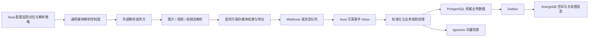

# Aura 通用媒体解析集成与多模数据架构开发计划

> 文档状态：0.2.0 实施基线（已完成代码与自动化验收）
> 适用范围：Aura API、AI 服务、PostgreSQL、pgvector、ArangoDB、Redis、外部媒体解析服务
> 核心原则：提供方无关、业务数据有唯一权威源、异步事件可靠交付、向量与图数据各用其长

## 1. 决策摘要

Aura 后续不再把图片、视频、视频流解析能力绑定到某一个具体产品，也不在业务代码中出现供应商专用客户端。系统新增通用的媒体解析提供方抽象，支持三类工作模式：

1. 图片同步解析：Aura 提交图片或可访问的媒体地址，提供方同步返回结构化结果。
2. 视频异步解析：Aura 创建解析任务，提供方异步处理，并通过事件推送或状态查询返回结果。
3. 视频流持续解析：Aura 声明某监控点位的期望解析状态，提供方拉取视频流持续解析，并按批次推送结构化事件。

目标数据链路如下：



数据库职责固定为：

| 组件 | 权威职责 | 不承担的职责 |
|---|---|---|
| PostgreSQL | 配置、任务、订阅、事件事实、抓拍、轨迹、ROI、告警、研判、事务状态、Inbox/Outbox | 不承担高频任意深度图遍历 |
| pgvector | Aura 业务需要持有的特征向量、相似度检索、结构化条件过滤 | 不承担媒体文件、业务状态或图关系 |
| ArangoDB | PostgreSQL 业务事实生成的空间图、关系图、路径与多跳分析 | 不作为业务权威源，不再长期承担旧的手工 ANN bucket 向量索引 |
| Redis | 缓存、限流、短期锁、短期加速队列、SignalR backplane | 不作为唯一可靠事件存储或唯一任务状态存储 |
| 文件/对象存储 | 图片、视频片段、楼层图和证据文件 | 不保存可查询业务关系 |

## 2. 当前基线

### 2.1 已有且应复用的能力

- Aura API 已有多节点 AI 地址热配置、HTTP 故障切换和健康检查。
- Aura AI 已支持通过 `AURA_EXTERNAL_EXTRACT_URLS` 转发同步图片特征提取。
- 外部特征响应可兼容 `feature`、`embedding`、`output` 等常见字段。
- 抓拍链路已经具备图片留存、失败重试、操作审计和 SignalR 通知。
- PostgreSQL 已保存设备、摄像头、楼层、ROI、抓拍、轨迹、人员、告警和基础拓扑边。
- 已有 `tenant_project`、`ai_provider_config` 等平台化基础表，但尚未形成完整的提供方能力模型。
- 已有 ArangoDB 部署和 Python 客户端，但当前仅用于 `aura_reid` 向量文档集合。
- 已有 Redis 缓存和列表型重试队列，可作为短期兼容机制。
- 已有 PostgreSQL 增量迁移器、迁移校验、Docker 启动顺序和运维检查入口。

### 2.2 当前关键缺口

| 编号 | 缺口 | 当前影响 | 目标状态 |
|---|---|---|---|
| GAP-01 | 没有通用媒体解析提供方领域模型 | 外部服务只能按 AI 节点地址理解 | 能力声明、认证、协议版本、状态均可配置 |
| GAP-02 | 没有视频文件异步任务 | 只能同步处理图片 | 支持提交、取消、查询、回调、重放 |
| GAP-03 | 没有视频流解析订阅 | Aura 无法声明哪些点位需要持续解析 | 使用期望状态与对账任务管理流订阅 |
| GAP-04 | 没有可靠事件 Inbox | Webhook 无法保证去重、重试和重放 | PostgreSQL 持久化后再应答，至少一次投递 |
| GAP-05 | 没有事务 Outbox | PostgreSQL 与 ArangoDB 无可靠同步边界 | 业务事务与 Outbox 同事务提交 |
| GAP-06 | 没有标准化解析事件模型 | 各提供方字段会污染业务代码 | 提供方适配器转换为版本化统一事件 |
| GAP-07 | PostgreSQL 没有 pgvector | 只保存 `feature_id`，完整向量在 ArangoDB | PostgreSQL 持久化 512 维向量并建立 ANN 索引 |
| GAP-08 | ArangoDB 没有图模型 | 未使用顶点集合、边集合和图遍历 | 建立 Aura 空间与关系命名图 |
| GAP-09 | ArangoDB 当前职责错位 | 用手工 bucket 承担向量检索 | 向量迁至 pgvector，ArangoDB 聚焦图投影 |
| GAP-10 | Redis 重试队列可靠性不足 | 出队即删除，进程异常可能丢任务 | 新链路以 PostgreSQL Inbox/任务表为准 |
| GAP-11 | 外部文件路径不可移植 | 外部服务通常无法读取 Aura 本地路径 | 使用对象存储 URL、预签名 URL 或流式上传 |
| GAP-12 | 缺少回调安全协议 | 无统一签名、防重放和租户隔离 | HMAC/mTLS/OAuth2 可配置，严格验证时间窗 |
| GAP-13 | 缺少提供方状态对账 | 一次启动请求不能代表流实际运行 | 期望状态、观测状态、租约、心跳和定期对账 |
| GAP-14 | 缺少全链路指标 | 无法定位提供方、Inbox、向量或图投影积压 | 统一 trace、事件延迟、积压和错误指标 |

## 3. 目标与非目标

### 3.1 目标

- 业务层不依赖任何具体媒体解析产品名称、SDK 或私有响应结构。
- 同一个 Aura 实例可以配置多个解析提供方，并按能力、租户、点位、模型或权重路由。
- 支持图片、视频文件和视频流三种不同生命周期。
- 外部事件允许重复、乱序和延迟到达，但不得产生重复业务副作用。
- PostgreSQL 成为任务、事件和业务事实的唯一权威源。
- pgvector 提供可评测、可迁移、可回滚的向量检索能力。
- ArangoDB 提供空间路径、人员共现、访问关系和多跳分析能力。
- 任何一个外部提供方或 ArangoDB 暂时故障时，Aura 的权威业务写入不能被破坏。
- 开发环境可使用提供方模拟器完成端到端测试，不依赖真实视频平台。

### 3.2 非目标

- Aura API 不直接转发或转码视频流。
- Aura 不实现通用视频编解码、目标检测或模型推理框架。
- 第一阶段不建设跨所有业务系统共享的中心图谱平台。
- 第一阶段不承诺 HTTP 回调的严格恰好一次投递；采用至少一次投递加幂等处理。
- 不把所有提供方原始字段永久复制到业务表；原始事件按保留策略归档。
- 不在 ArangoDB 与 pgvector 中长期保存两份权威向量。

## 4. 领域边界与组件

### 4.1 Aura 控制面

Aura 决定“解析什么、为什么解析、解析结果如何进入业务”，负责：

- 媒体来源与监控点位映射。
- 解析提供方、能力、管线、模型和路由策略配置。
- 图片任务、视频任务和流订阅的期望状态。
- 提供方调用、重试、熔断、限流和状态对账。
- 回调鉴权、事件落库、标准化和业务分发。
- ROI、轨迹、告警、研判、向量和图投影。

### 4.2 外部解析提供方

外部提供方决定“如何解析媒体”，负责：

- 拉取或接收图片、视频文件和视频流。
- 解码、抽帧、检测、跟踪、分类、OCR、Re-ID 等算法执行。
- 生成结构化检测结果、Track、候选实体和可选 embedding。
- 保存提供方拥有的中间媒体结果。
- 按协议推送事件、报告任务状态并支持重放。

### 4.3 Aura 业务处理面

标准化事件进入 Aura 后，按以下顺序处理：

1. 验证租户、提供方、订阅和点位映射。
2. 按 `event_id` 幂等去重。
3. 将提供方事件转换为 Aura 标准事件。
4. 保存抓拍、轨迹、媒体引用和可选 embedding。
5. 执行 ROI 空间碰撞、虚拟人员关联和业务规则。
6. 在同一个 PostgreSQL 事务中写入业务事实与 Outbox。
7. 异步投影到 ArangoDB。
8. 推送 SignalR、告警通知和审计信息。

## 5. 通用提供方模型

### 5.1 核心抽象

核心代码使用以下中性接口，具体提供方通过适配器实现：

```csharp
public interface IMediaAnalysisProvider
{
    Task<ProviderCapabilities> GetCapabilitiesAsync(CancellationToken ct);
    Task<AnalysisSubmission> AnalyzeImageAsync(ImageAnalysisRequest request, CancellationToken ct);
    Task<AnalysisJobRef> SubmitVideoAsync(VideoAnalysisRequest request, CancellationToken ct);
    Task<AnalysisJobState> GetJobAsync(string externalJobId, CancellationToken ct);
    Task CancelJobAsync(string externalJobId, CancellationToken ct);
    Task<StreamSubscriptionState> UpsertStreamAsync(StreamAnalysisRequest request, CancellationToken ct);
    Task StopStreamAsync(string externalSubscriptionId, CancellationToken ct);
}
```

建议的实现分层：

- `IMediaAnalysisProvider`：领域层能力接口。
- `MediaAnalysisProviderResolver`：按配置和能力选择适配器。
- `StandardHttpMediaAnalysisProvider`：实现 Aura 标准 HTTP 协议。
- `CustomProviderAdapter`：未来适配无法遵循标准协议的第三方系统。
- `MediaAnalysisOrchestrator`：管理任务、订阅和期望状态，不处理厂商字段。

### 5.2 能力声明

每个提供方至少声明：

```json
{
  "protocol_version": "1.0",
  "capabilities": [
    "image.sync",
    "video.async",
    "stream.subscription",
    "event.webhook",
    "event.replay",
    "embedding.reference",
    "artifact.presigned-url"
  ],
  "pipelines": [
    {
      "code": "person-reid",
      "models": ["person-detect", "person-track", "reid"],
      "embedding_dimension": 512
    }
  ]
}
```

Aura 不应根据提供方名称猜测能力。创建任务前必须根据能力声明验证请求。

### 5.3 图片、视频和流接口

标准协议建议：

| 方法 | 路径 | 用途 |
|---|---|---|
| `GET` | `/v1/capabilities` | 能力和协议版本 |
| `POST` | `/v1/analysis/images` | 同步或快速异步图片解析 |
| `POST` | `/v1/analysis/videos` | 创建视频解析任务 |
| `GET` | `/v1/analysis/jobs/{id}` | 查询任务状态 |
| `POST` | `/v1/analysis/jobs/{id}/cancel` | 取消任务 |
| `PUT` | `/v1/analysis/streams/{clientSubscriptionId}` | 幂等创建或更新流订阅 |
| `GET` | `/v1/analysis/streams/{clientSubscriptionId}` | 查询观测状态 |
| `DELETE` | `/v1/analysis/streams/{clientSubscriptionId}` | 停止流订阅 |
| `POST` | `/v1/events/replay` | 按游标或时间区间重放事件 |

提供方路径差异由适配器处理，不能传播到 Aura 业务服务。

### 5.4 流订阅请求

```json
{
  "protocol_version": "1.0",
  "tenant_code": "aura-default",
  "client_subscription_id": "stream-sub-1001",
  "source": {
    "source_id": "camera-1001",
    "type": "rtsp",
    "uri": "rtsp://camera-host/Streaming/Channels/101",
    "credential_ref": "secret://aura/cameras/1001"
  },
  "pipeline": {
    "code": "person-reid",
    "model_version": "approved",
    "sample_fps": 5,
    "options": {}
  },
  "delivery": {
    "mode": "webhook",
    "endpoint": "https://aura.example/api/integrations/media-analysis/v1/events"
  }
}
```

约束：

- `client_subscription_id` 由 Aura 生成，重复 PUT 必须幂等。
- 不在普通配置 JSON 中保存明文摄像头密码。
- `credential_ref` 由部署环境的密钥管理或安全凭据服务解析。
- 若提供方不能解析凭据引用，应使用短期令牌或一次性加密凭据交换。
- Aura 必须验证提供方网络是否能访问媒体来源。

### 5.5 标准事件信封

```json
{
  "schema_version": "1.0",
  "event_id": "evt_01J...",
  "provider_event_id": "provider_evt_9527",
  "tenant_code": "aura-default",
  "provider_code": "provider-a",
  "subscription_id": "stream-sub-1001",
  "source_id": "camera-1001",
  "sequence": 10521,
  "event_type": "track.updated",
  "event_time": "2026-07-22T10:30:21.123+08:00",
  "produced_at": "2026-07-22T10:30:21.456+08:00",
  "trace_id": "4bf92f3577b34da6a3ce929d0e0e4736",
  "payload": {
    "track_id": "track-9527",
    "entity_candidate_id": "person-318",
    "embedding_id": "emb-786",
    "confidence": 0.93,
    "bbox": [0.12, 0.18, 0.35, 0.71],
    "snapshot_url": "https://object-store/signed/snapshot.jpg"
  }
}
```

第一阶段支持的标准事件类型：

- `analysis.job.started`
- `analysis.job.progress`
- `analysis.job.completed`
- `analysis.job.failed`
- `stream.started`
- `stream.heartbeat`
- `stream.degraded`
- `stream.stopped`
- `object.detected`
- `track.started`
- `track.updated`
- `track.ended`
- `identity.candidate`
- `behavior.detected`
- `artifact.ready`

未知事件类型先进入 Inbox 并标记 `unsupported`，不得直接丢弃，以便协议升级后重放。

### 5.6 状态机

视频任务状态：

```text
pending -> submitting -> accepted -> running -> completed
                     \-> rejected
running -> cancelling -> cancelled
running -> failed -> retry_wait -> submitting
```

流订阅同时保存期望状态与观测状态：

```text
desired: stopped | running
observed: unknown | starting | running | degraded | stopping | stopped | failed
```

Aura 的对账 Worker 周期性比较两者：

- `desired=running` 且提供方无任务：幂等创建。
- 配置版本变化：幂等更新。
- `desired=stopped` 且仍在运行：发起停止。
- 心跳超时：标记 `degraded` 并触发状态查询。
- 多次对账失败：进入告警，不无限快速重试。

## 6. 可靠事件入口

### 6.1 投递语义

采用“至少一次投递 + Aura 幂等处理”：

- 提供方必须为事件分配稳定 `event_id`。
- Aura 仅在签名验证通过且 Inbox 持久化成功后返回 `2xx`。
- 业务处理失败不要求提供方重新发送，Aura 自己从 Inbox 重试。
- 相同 `event_id` 重复到达返回成功，但不产生第二次业务副作用。
- 无法永久处理的事件进入 dead-letter 状态，支持人工修复后重放。

### 6.2 Webhook 接收步骤

1. 限制请求体大小和事件批次数量。
2. 读取提供方标识、时间戳、nonce 和签名头。
3. 验证时间窗、HMAC/mTLS/OAuth2、来源权限和租户绑定。
4. 计算原始请求摘要，防止同一签名对应不同内容。
5. 使用唯一约束批量插入 Inbox。
6. 返回已接受、重复和拒绝数量。
7. 后台 Worker 使用 `FOR UPDATE SKIP LOCKED` 获取待处理事件。

### 6.3 Inbox 状态

```text
received -> processing -> processed
                      \-> retry_wait -> processing
                      \-> dead_letter
received -> unsupported
```

必须记录：尝试次数、下一次重试时间、最后错误类型、最后错误摘要、处理节点和锁过期时间。

### 6.4 顺序与迟到事件

- `sequence` 只在同一个订阅或来源内比较，不设计全局序列。
- 轨迹事件按 `event_time` 作为业务时间，`received_at` 作为接收时间。
- 允许短时间乱序，通过 Track 聚合窗口修正。
- 超过允许迟到窗口的事件仍保存，但标记 `late_event=true`。
- 需要严格顺序的处理器使用每订阅游标；不需要严格顺序的检测事件可并行处理。

### 6.5 消息队列兼容

第一阶段使用 HTTP Webhook + PostgreSQL Inbox，不新增必须运维的消息中间件。未来接入 Kafka、RabbitMQ 或其他队列时，消费者只负责将消息写入同一 Inbox，后续处理流程保持不变。

Redis 列表不能替代 Inbox，因为当前列表出队即删除，消费者在处理完成前崩溃会造成数据丢失。

## 7. PostgreSQL 合理化方案

### 7.1 定位

PostgreSQL 是唯一业务权威源，承担：

- 提供方和管线配置。
- 媒体来源、解析任务和流订阅。
- Inbox、Outbox 和投影游标。
- 原始事件引用和标准化事件事实。
- 抓拍、轨迹、ROI、告警、研判和人员实体。
- embedding 元数据以及 pgvector 向量。

### 7.2 新增表

#### `media_analysis_provider`

| 字段 | 说明 |
|---|---|
| `provider_id` | 主键 |
| `tenant_id` | 可空；为空表示全局提供方 |
| `provider_code` | 稳定唯一代码 |
| `display_name` | 展示名称 |
| `adapter_type` | `standard_http` 或适配器代码 |
| `base_url` | 服务根地址 |
| `auth_type` | `hmac`、`bearer`、`oauth2_client`、`mtls` |
| `secret_ref` | 密钥引用，不保存明文密钥 |
| `capabilities_json` | 最近一次能力发现结果 |
| `protocol_version` | 协议版本 |
| `enabled` | 是否允许调度 |
| `timeout_seconds` | 超时 |
| `max_concurrency` | 本地并发保护 |
| `created_at/updated_at` | 审计时间 |

现有 `ai_provider_config` 暂时保留给旧 AI 配置和 A/B 页面，不直接扩展成流平台表。完成迁移后再决定是否废弃，避免一次迁移破坏现有功能。

#### `media_analysis_pipeline`

保存提供方可用的解析管线、模型版本、输入类型、输出类型、embedding 维度和默认参数。`provider_id + pipeline_code + version` 唯一。

#### `media_source`

保存 Aura 点位到提供方媒体来源的中性映射：

- `source_id`、`tenant_id`、`camera_id`
- `source_type`：`rtsp`、`http`、`file`、`object`
- `uri_template` 或安全引用
- `credential_ref`
- `stream_profile`、`enabled`
- `config_version`

不得在表中保存可直接使用的明文 NVR 密码。

#### `media_analysis_subscription`

保存流解析的期望状态和观测状态：

- 本地订阅 ID、提供方 ID、来源 ID、管线 ID
- `desired_state`、`observed_state`
- `external_subscription_id`
- `desired_config_json`、`applied_config_hash`
- `last_heartbeat_at`、`last_reconciled_at`
- `retry_count`、`next_retry_at`、`last_error`
- `version`，用于乐观并发控制

唯一约束建议为 `(tenant_id, source_id, pipeline_id)`。

#### `media_analysis_job`

保存图片/视频异步任务：

- 本地任务 ID、外部任务 ID、幂等键
- 提供方、管线、租户、来源
- 媒体引用、状态、进度
- 提交时间、开始时间、完成时间
- 重试次数、错误码、错误摘要
- 请求摘要和结果摘要

#### `media_analysis_inbox`

保存收到的原始事件：

- `inbox_id` 主键
- `provider_id`、`tenant_id`、`event_id`
- `subscription_id`、`source_id`、`sequence`
- `schema_version`、`event_type`
- `event_time`、`produced_at`、`received_at`
- `payload_json`、`payload_hash`
- `status`、`attempt_count`、`next_attempt_at`
- `locked_by`、`lock_until`
- `last_error_code`、`last_error`

唯一约束为 `(provider_id, event_id)`。高数据量时按 `received_at` 月度分区。

#### `media_analysis_event`

保存经过验证和标准化后的领域事件，供轨迹、统计和审计使用。原始提供方 payload 留在 Inbox，标准事件只保存稳定字段和受控 `detail_json`。

建议按 `event_time` 月度分区，并建立：

- `(tenant_id, source_id, event_time DESC)`
- `(tenant_id, event_type, event_time DESC)`
- `(tenant_id, track_id, event_time)`
- `(tenant_id, entity_id, event_time DESC)`

#### `integration_outbox`

保存需要投递给 ArangoDB、通知系统或其他内部消费者的事件：

- `outbox_id`、`aggregate_type`、`aggregate_id`
- `event_type`、`payload_json`
- `created_at`、`available_at`
- `status`、`attempt_count`、`last_error`
- `locked_by`、`lock_until`

业务事实和 Outbox 必须在同一 PostgreSQL 事务中提交。

#### `media_artifact`

保存快照、视频片段和解析产物引用：

- 提供方 URI、Aura 归档 URI、媒体类型、大小、SHA-256
- 产生时间、过期时间、归档状态
- 对关键告警证据执行异步归档，不能依赖即将过期的提供方签名 URL

#### `embedding_model` 与 `feature_embedding`

第一阶段只承载 Aura 已确定的 512 维 Re-ID 特征：

- `embedding_model`：提供方、模型名、版本、维度、距离度量、是否启用。
- `feature_embedding`：`embedding_id`、`tenant_id`、`vid`、`capture_id`、`model_id`、`feature vector(512)`、元数据和时间。

约束：

- `capture_id` 关联 `capture_record`。
- `(tenant_id, model_id, vid)` 根据业务选择唯一或非唯一；默认允许同一人员多条样本向量。
- 向量必须在写入前进行维度、有限数值和归一化校验。
- 其他维度模型后续使用独立模型表/向量表或模型专属分区，不把不同维度混入同一个 ANN 索引。

### 7.3 现有表加固

`space_topology_edge` 增加：

- `from_camera_id`、`to_camera_id` 到 `map_camera` 的外键。
- `(from_camera_id, to_camera_id, relation_type)` 唯一约束。
- `to_camera_id` 反向查询索引。
- `updated_at`、`enabled`、可选 `valid_from/valid_to`。
- 明确有向边；双向通行应保存两条有向边或由领域层统一展开，不能混用。

`capture_record` 增加或调整：

- `tenant_id`、`camera_id`，减少仅依赖设备和通道反查点位。
- `analysis_event_id` 或来源事件引用。
- `feature_id` 逐步改为真实 embedding 外键或增加 `embedding_id` 新列后迁移。
- 新增表和新接口统一使用 `TIMESTAMPTZ`，避免跨时区歧义。

### 7.4 多租户

现有 `tenant_project` 只是基础，尚未覆盖所有业务表。新表必须从第一天携带 `tenant_id`，所有唯一键、查询和 Arango 图文档都包含租户维度。旧表租户化应单独迁移，不在媒体集成首个版本中隐式完成。

## 8. pgvector 方案

### 8.1 部署

- 将 PostgreSQL 基础镜像替换为经过批准、包含 pgvector 扩展的内部镜像。
- 离线部署包必须同时包含该镜像。
- 迁移执行 `CREATE EXTENSION IF NOT EXISTS vector`，扩展不可用时明确失败，不能静默跳过。
- 在开发、测试、生产使用一致的扩展大版本，并纳入镜像清单和 SBOM。

### 8.2 索引策略

- 在线持续写入场景优先评估 HNSW cosine 索引。
- 保留精确检索开关，用于小数据集、回归基线和召回率评测。
- 元数据过滤使用普通 B-tree/GIN 索引，先限定租户、模型和业务范围，再执行向量排序。
- 索引参数不得直接硬编码在业务代码中，通过迁移和运维配置管理。
- 是否使用其他 ANN 索引必须基于目标数据规模、写入速率和 Recall@K 压测决定。

示意查询：

```sql
SELECT embedding_id, vid, 1 - (feature <=> @query) AS score
FROM feature_embedding
WHERE tenant_id = @tenant_id
  AND model_id = @model_id
ORDER BY feature <=> @query
LIMIT @top_k;
```

### 8.3 向量权威归属

- 如果外部提供方只返回 `embedding_id` 且提供稳定检索 API，Aura 可以只保存引用。
- 如果 Aura 需要离线部署、跨提供方统一检索或业务自主可用性，则由提供方按授权返回向量，Aura 在 pgvector 保存业务副本。
- 两种模式由管线能力配置决定，不在事件处理器中猜测。
- 即使 Aura 保存向量，提供方内部向量仍属于提供方；Aura pgvector 是 Aura 业务域的权威检索副本。

### 8.4 从 ArangoDB 迁移向量

1. 抽象 `IVectorIndex`，保留旧 Arango 实现并新增 pgvector 实现。
2. 导出 `aura_reid` 的 `vid`、`feature`、`metadata` 和模型信息。
3. 校验维度、归一化、重复 `vid` 和无效数值后回填 pgvector。
4. 进入迁移窗口：旧 Arango 和 pgvector 双写，但 pgvector 写失败必须可观察和补偿。
5. 双读影子验证，比较 TopK 重叠率、Recall@K、MRR、延迟和空结果率。
6. pgvector 达标后切换主读，保留 Arango 回退一个发布周期。
7. 停止 Arango 向量写入，确认无回退后删除 `ann_bucket_*` 相关代码和回填任务。
8. ArangoDB 保留并转为图数据库职责。

迁移期双写只是过渡措施，不作为长期架构。

## 9. ArangoDB 图数据库方案

### 9.1 定位

ArangoDB 保存 PostgreSQL 事实的可重建图投影。任何图写入失败都不得回滚已经成功提交的 PostgreSQL 业务事务，而应让 Outbox 保留并重试。

建议创建独立数据库 `aura_graph` 和最小权限账号，与旧 `aura_reid` 向量集合隔离。

### 9.2 顶点集合

| 集合 | 来源 | 说明 |
|---|---|---|
| `campuses` | `dict_campus` | 园区节点 |
| `buildings` | `dict_campus` | 楼栋节点 |
| `floors` | `dict_campus`、`map_floor` | 楼层与图纸元数据引用 |
| `rooms` | `dict_campus` | 房间节点 |
| `cameras` | `map_camera`、`nvr_device` | 监控点位，不保存明文凭据 |
| `rois` | `map_roi` | ROI 与几何摘要 |
| `persons` | `virtual_person` | Aura 虚拟人员 |
| `analysis_sources` | `media_source` | 通用解析来源引用 |

不建议把每一个原始检测框或每一帧都建成图顶点。高频原始事实留在 PostgreSQL 分区表，图中保存可查询实体和聚合关系。

### 9.3 边集合

| 集合 | 方向 | 说明 |
|---|---|---|
| `contains` | 园区/楼栋/楼层 -> 子空间 | 资源树 |
| `located_in` | 摄像头/ROI -> 空间 | 空间归属 |
| `covers` | 摄像头 -> ROI/房间 | 覆盖关系 |
| `connects` | 摄像头 -> 摄像头 | 有向通行拓扑，含权重和预计时间 |
| `visited` | 人员 -> 房间/摄像头 | 按日或时间桶聚合访问 |
| `co_occurs` | 人员 -> 人员 | 按时间窗口聚合共现次数与置信度 |
| `transition` | 摄像头 -> 摄像头 | 从历史轨迹计算的转移概率 |

边文档至少包含：`tenant_id`、`source_version`、`updated_at`。动态聚合边还包含 `bucket_start`、`count`、`first_seen`、`last_seen` 和置信度。

### 9.4 图投影规则

- PostgreSQL 主键转换为稳定 Arango `_key`，例如 `camera_123`、`person_C_456`。
- Outbox 事件必须幂等，重复投影只更新同一个文档或边。
- 边 `_key` 由租户、关系类型、起点、终点和时间桶生成确定性哈希。
- 删除采用显式 tombstone/删除事件，不能依赖定时全量覆盖。
- 投影 Worker 保存最后处理游标和失败原因。
- 提供全量重建命令，可从 PostgreSQL 在空的 `aura_graph` 中重建全部静态图和聚合图。

### 9.5 图查询能力

第一批 API：

- 指定摄像头 N 跳可达点位。
- 两个摄像头之间的候选路径和最短路径。
- 人员在时间范围内访问过的空间。
- 与人员共现的一度、二度关系。
- 指定房间相关人员和最近活动。
- 图投影版本、延迟和健康状态。

复杂社区发现、中心性、割点分析和大规模离线图算法放到后续阶段，先以真实查询和数据规模证明需求。

## 10. Redis 与媒体存储

### 10.1 Redis

继续用于：

- 提供方调用限流和短期熔断状态。
- 热点能力声明缓存。
- Worker 短期协调锁；业务正确性不能只依赖锁。
- SignalR backplane。
- 兼容旧抓拍重试队列，直至新任务系统接管。

不得用于：

- 唯一 Inbox。
- 唯一任务状态。
- 唯一重放日志。
- PostgreSQL 到 ArangoDB 的唯一同步通道。

### 10.2 媒体文件

- 大图片和视频不得以 Base64 长期存入数据库或事件消息。
- 推荐使用可控对象存储或现有 `storage` 的统一媒体服务出口。
- 提供方返回的临时 URL 只作为短期取件地址。
- 关键抓拍和告警证据由 Aura 异步复制到自有存储并校验 SHA-256。
- 记录内容类型、大小、创建时间、保留策略和来源。

## 11. 核心业务流程

### 11.1 图片解析

```text
Aura 创建 image job 和幂等键
-> 选择具备 image.sync 的提供方
-> 发送对象 URL 或受限 Base64
-> 标准化响应
-> 保存任务结果/embedding
-> 执行抓拍、ROI、轨迹和业务规则
-> 写 Outbox
```

同步请求超时不能直接认定提供方未处理。重试必须使用相同幂等键，并允许后续查询任务状态。

### 11.2 视频文件解析

```text
Aura 创建 pending job
-> 提交媒体引用
-> 保存 external_job_id
-> 提供方异步解析
-> 进度/结果事件写 Inbox
-> 标准化并批量写事件事实
-> 业务处理与图投影
```

### 11.3 视频流解析

```text
管理员为点位启用解析策略
-> subscription.desired_state=running
-> 对账 Worker 调用提供方幂等 PUT
-> 提供方拉流并发 heartbeat/track 事件
-> Aura Inbox 快速应答
-> 后台标准化与业务处理
-> 停用时 desired_state=stopped
-> 对账 Worker 停止外部订阅
```

### 11.4 事件到业务

- `object.detected`：保存检测事实和可选媒体引用，不直接生成虚拟人员。
- `track.*`：维护提供方 Track 到 Aura 临时轨迹的映射。
- `identity.candidate`：通过阈值、模型版本和业务策略决定是否关联 `virtual_person`。
- `behavior.detected`：先保存算法事实，再由 Aura 规则决定是否形成告警。
- 点位事件通过 `media_source -> camera_id` 映射后执行 ROI 和空间逻辑。
- 所有算法结论保存模型版本、置信度和来源，便于复核。

## 12. Aura API 与管理功能

### 12.1 管理 API

- `GET/POST/PUT /api/media-analysis/providers`
- `POST /api/media-analysis/providers/{id}/test`
- `GET /api/media-analysis/providers/{id}/capabilities`
- `GET/POST/PUT /api/media-analysis/pipelines`
- `GET/POST/PUT /api/media-analysis/sources`
- `GET/PUT/DELETE /api/media-analysis/subscriptions/{id}`
- `POST /api/media-analysis/subscriptions/{id}/reconcile`
- `GET /api/media-analysis/jobs`
- `POST /api/media-analysis/jobs/{id}/cancel`
- `POST /api/media-analysis/jobs/{id}/retry`

### 12.2 集成入口

- `POST /api/integrations/media-analysis/v1/events`
- `POST /api/integrations/media-analysis/v1/events/batch`
- `GET /api/integrations/media-analysis/v1/health` 仅供已认证提供方探测

### 12.3 运维 API

- Inbox 积压、失败、dead-letter 查询和重放。
- Outbox/Arango 投影积压与重放。
- 提供方健康、延迟、错误率和心跳状态。
- pgvector 检索指标、索引状态和离线评测结果。
- Arango 图版本、投影延迟和重建状态。

所有管理和重放接口需要新增细粒度权限，不复用普通设备查看权限。

## 13. 代码组织建议

后端新增：

```text
backend/Aura.Api/
  MediaAnalysis/
    Contracts/
    Providers/
    MediaAnalysisOrchestrator.cs
    ProviderResolver.cs
    SubscriptionReconciler.cs
    InboxProcessor.cs
    EventNormalizer.cs
    EventHandlers/
  Vector/
    IVectorIndex.cs
    PgVectorIndex.cs
    LegacyArangoVectorIndex.cs
  Graph/
    IGraphRepository.cs
    ArangoGraphRepository.cs
    GraphProjectionWorker.cs
    GraphRebuildService.cs
  Data/
    MediaAnalysisRepository.cs
    InboxRepository.cs
    OutboxRepository.cs
    VectorRepository.cs
```

端点建议新增 `AuraEndpointsMediaAnalysis.cs`，不要继续把所有能力堆入 `AuraEndpointsDomain.cs`。

Worker 初期可作为 `BackgroundService` 运行在 Aura API 中，但必须使用数据库租约和 `SKIP LOCKED` 支持多副本。生产量达到独立扩缩容需求后，再无损拆为 `Aura.Workers`，领域接口和表结构不变。

Python AI 服务演进：

- 保留一个发布周期作为旧图片提取和 Arango 向量兼容层。
- 新链路由 .NET 通用媒体解析控制面负责，不再向 Python 服务增加视频任务和流订阅职责。
- pgvector 切换完成后移除 Python 中的 `ArangoIndexService` 和 `ann_bucket_*`。
- 若仍需要本地 ONNX 回退，将 Python AI 注册成一个标准媒体解析提供方，而不是特殊内置分支。

## 14. 数据库迁移与部署计划

当前迁移最大编号为 `014`，建议按以下顺序新增，最终名称以实施内容为准：

1. `015_add_media_analysis_control_plane.sql`
   - provider、pipeline、source、subscription、job。
2. `016_add_media_analysis_inbox_outbox.sql`
   - inbox、标准事件、outbox、artifact、处理索引。
3. `017_enable_pgvector_and_add_embeddings.sql`
   - `vector` 扩展、模型和 embedding 表、ANN 索引。
4. `018_harden_space_topology.sql`
   - 外键、唯一约束、反向索引和有效状态。
5. `019_add_projection_checkpoints.sql`
   - 图投影、重建和对账状态。

要求：

- 同步更新 `database/schema.pgsql.sql` 和 `database/migrations/README.txt`。
- 已执行的历史迁移不得改写。
- 在执行 `017` 之前先部署包含 pgvector 的 PostgreSQL 镜像。
- 大表索引在生产环境使用受控维护窗口或在线索引策略。
- 所有新表先支持空数据部署，再启动 Worker，避免部署过程中提前消费。

Docker 调整：

- PostgreSQL 镜像替换为内部批准的 pgvector 镜像。
- `arango-init` 同时确保 `aura_graph` 数据库、图账号和最小权限存在。
- 增加通用提供方、Webhook、安全、Inbox/Outbox Worker 和 Arango 图连接配置。
- readiness 增加 pgvector 扩展、Inbox Worker、Outbox Worker、图投影和提供方状态，但不能因某个非必需提供方故障让整个 Aura 进程失活。

## 15. 安全设计

- Webhook 默认使用 HMAC-SHA256，签名覆盖时间戳、nonce 和原始请求体摘要。
- 可选支持 mTLS 或 OAuth2 client credentials。
- 时间戳允许窗口可配置，nonce 在窗口内不得重复。
- 每个提供方使用独立密钥和最小权限账号。
- 提供方配置 URL 必须限制为 HTTP/HTTPS，禁止查询串注入，并支持主机 allowlist。
- 防止 SSRF：不能允许普通用户配置任意内网 URL；解析后的目标 IP 也要校验策略。
- 回调端点不使用普通用户 JWT，但必须通过提供方认证和租户绑定。
- 日志不记录完整 Authorization、签名、摄像头密码、RTSP 凭据和原始向量。
- 事件和媒体下载设置大小、类型、超时、重定向次数和域名限制。
- embedding、抓拍和人员关系按数据分级执行访问控制、保留和删除策略。

## 16. 可观测性

### 16.1 指标

提供方：

- 调用次数、成功率、超时率、熔断状态和节点延迟。
- 运行中/异常/心跳超时的流订阅数。
- 视频任务各状态数量和完成耗时。

事件入口：

- Webhook 请求数、签名失败数、重复事件数。
- Inbox received/processing/retry/dead-letter 数量。
- `received_at - produced_at` 传输延迟。
- `processed_at - received_at` 处理延迟。

pgvector：

- 向量数量、按模型/租户分布。
- 查询 P50/P95/P99、空结果率、精确/ANN 查询比例。
- 离线 Recall@K、MRR 和 TopK 重叠率。

ArangoDB：

- Outbox 积压、最老事件年龄和投影失败数。
- 图顶点/边数量、重建进度。
- 路径查询 P95/P99、超时和截断次数。

### 16.2 追踪与日志

统一贯穿：

- `request_id`
- `trace_id`
- `event_id`
- `job_id`
- `subscription_id`
- `provider_id`
- `source_id`

错误日志保存受控摘要，不直接输出完整 payload。原始 payload 由权限受限的运维接口查询。

## 17. 故障与降级策略

| 故障 | 预期行为 |
|---|---|
| 提供方不可用 | 新任务进入重试等待；现有业务查询继续；订阅标记 degraded |
| Webhook 重复 | Inbox 唯一键去重，返回成功，不重复告警或轨迹 |
| Webhook 乱序 | 按业务时间和订阅序列处理，标记迟到事件 |
| PostgreSQL 不可用 | 不确认回调，返回可重试错误；提供方稍后重投 |
| Redis 不可用 | 缓存和实时能力降级；Inbox/Outbox 正确性不受影响 |
| pgvector 查询失败 | 向量搜索返回明确受限状态；结构化事件仍可落库 |
| ArangoDB 不可用 | PostgreSQL 业务事务继续；Outbox 积压；图查询返回过期/不可用状态 |
| Worker 崩溃 | 数据库租约过期后其他实例接管 |
| 提供方临时 URL 过期 | artifact 归档失败进入重试/死信，不能伪造成功 |
| 模型版本变化 | 新旧模型向量隔离，不跨模型直接比较 |

## 18. 测试计划

### 18.1 单元测试

- 能力匹配和提供方选择。
- 状态机合法/非法迁移。
- HMAC、防重放和租户绑定。
- 事件标准化、未知类型和版本兼容。
- Inbox 幂等、重试退避和 dead-letter。
- Outbox 幂等图键生成。
- 512 维向量校验、模型隔离和阈值处理。

### 18.2 集成测试

- 使用真实 PostgreSQL + pgvector 容器验证迁移和向量查询。
- 使用真实 ArangoDB 容器验证图初始化、幂等投影和遍历。
- 多 API 实例并发消费 `SKIP LOCKED`，确保不重复处理。
- 提供方模拟器覆盖超时、500、429、重复、乱序、签名错误和部分批次失败。
- 数据库重启、ArangoDB 中断和 Worker 崩溃恢复。

### 18.3 契约测试

- 标准提供方协议发布 JSON Schema/OpenAPI。
- 每个适配器必须通过同一套提供方契约测试。
- 事件 Schema 保持向后兼容；新增字段可忽略，删除/改义必须升级主版本。

### 18.4 端到端测试

- 图片提交到抓拍、embedding、检索和业务结果。
- 视频任务提交、进度、完成、取消和重放。
- 流订阅启停、心跳丢失、恢复和重复事件。
- Track 到摄像头、ROI、房间、轨迹、告警和 Arango 图关系。
- 以图搜人结果关联 PostgreSQL 抓拍和 Arango 空间路径。

### 18.5 性能与容量测试

使用模拟生产规模数据分别测量：

- Webhook 批量写入吞吐与最大安全批次。
- Inbox/Outbox 积压后的追赶速度。
- pgvector 在目标向量量和并发下的 Recall@K 与延迟。
- ArangoDB 在目标顶点/边数量下的 N 跳和最短路径延迟。
- PostgreSQL 事件分区、保留和归档任务对在线写入的影响。

性能指标必须绑定硬件、数据规模和并发，不能只写脱离环境的单一毫秒目标。

## 19. 分阶段实施计划

### 阶段 0：架构与契约冻结

交付：

- 架构决策记录：数据权威源、投递语义、向量归属和图投影。
- 通用提供方 OpenAPI、事件 JSON Schema、签名规范和错误码。
- 图片、视频、流三类状态机。
- 提供方模拟器最小版本。

完成条件：业务代码和配置中不出现任何具体产品命名。

### 阶段 1：控制面与提供方适配

交付：

- `media_analysis_provider/pipeline/source/subscription/job` 迁移。
- 管理 API、权限和审计。
- `IMediaAnalysisProvider`、标准 HTTP 适配器和能力发现。
- 流订阅期望状态、状态查询和对账 Worker。

完成条件：模拟提供方可以由 Aura 启动、更新、停止流任务并显示真实状态。

### 阶段 2：可靠事件入口

交付：

- Webhook 签名、防重放、批量接收。
- Inbox、标准事件、dead-letter 和重放。
- 通用事件标准化与 Track 映射。
- Prometheus/OpenTelemetry 指标。

完成条件：重复、乱序、进程崩溃和提供方重试不会造成事件丢失或重复业务副作用。

### 阶段 3：业务事件接入

交付：

- `object/track/identity/behavior` 处理器。
- 点位映射、抓拍归档、ROI、轨迹和告警链路。
- 旧同步抓拍链路与新事件链路的幂等合并规则。
- 视频任务和流订阅管理页面。

完成条件：模拟流事件可以在 Aura 页面形成可追溯抓拍、轨迹和告警。

### 阶段 4：pgvector 落地与迁移

交付：

- pgvector 镜像、迁移、`IVectorIndex` 和 pgvector 实现。
- Arango 旧向量导出回填工具。
- 双写、双读影子评测和切换开关。
- 向量运维指标和离线质量报告。

完成条件：目标样本集 Recall@K、MRR、空结果率和延迟达到验收线，能够回滚到旧读路径。

### 阶段 5：ArangoDB 图投影

交付：

- `aura_graph` 初始化、最小权限账号和图集合。
- Outbox、投影 Worker、检查点和全量重建。
- 空间资源、拓扑、访问和共现投影。
- N 跳、候选路径、人员关系查询 API。

完成条件：PostgreSQL 与图投影可对账，删除、重复事件和全量重建均通过测试。

### 阶段 6：旧链路收敛与生产加固

交付：

- pgvector 主读，停止 Arango 向量写入。
- 移除 `ann_bucket_*` 和对应回填逻辑。
- 新 Inbox/任务系统接管相关重试，旧 Redis 队列只保留兼容期。
- 灾备、备份、恢复、图重建、事件重放和容量扩展手册。
- 全量压测、安全测试和灰度发布。

完成条件：连续一个发布周期无旧向量回退，生产演练能够恢复 PostgreSQL、重建 Arango 图并重放积压事件。

## 20. 优先级与依赖

```text
P0 契约/安全/Inbox
  -> P0 控制面与流订阅
  -> P0 业务事件落库
  -> P1 pgvector 迁移
  -> P1 Outbox 与 Arango 图
  -> P1 运维与管理页面
  -> P2 高级图算法和多消息中间件适配
```

依赖关系：

- 没有稳定事件 Schema，不开始多个提供方适配。
- 没有 Inbox，不允许生产 Webhook 直接触发业务写入。
- 没有 Outbox，不允许在业务请求中直接双写 PostgreSQL 和 ArangoDB。
- 没有 pgvector 生产镜像和回滚方案，不停止 Arango 旧向量链路。
- 没有图重建能力，不把 ArangoDB 作为生产图查询主路径。

## 21. 验收标准

### 21.1 功能验收

- 至少一个标准模拟提供方完整通过图片、视频和流契约。
- Aura 可启停指定点位解析并看到期望状态和观测状态。
- 提供方结果可形成抓拍、轨迹、ROI、告警和研判。
- pgvector 可写入、检索、过滤和按模型隔离。
- ArangoDB 可查询点位路径、人员访问和共现关系。

### 21.2 可靠性验收

- 相同事件重复投递 100 次只产生一次业务副作用。
- Worker 在落库后、确认前和处理中三个位置崩溃均可恢复。
- PostgreSQL 短暂不可用时提供方事件最终可重投成功。
- ArangoDB 停止期间 PostgreSQL 正常写入，恢复后投影自动追平。
- 支持按事件 ID、时间范围和 dead-letter 状态重放。

### 21.3 数据一致性验收

- PostgreSQL 业务事实与 Outbox 同事务。
- 图中每个实体和关系可追溯到 PostgreSQL 主键或事件。
- pgvector 中每个业务向量可追溯到模型版本和抓拍/人员。
- 提供方 Track、Aura VID 和 embedding 不被当作同一个标识混用。

### 21.4 安全验收

- 错误签名、过期时间戳、重复 nonce、越权租户全部拒绝。
- 提供方 URL 配置通过 SSRF 约束测试。
- 日志和管理 API 不泄露明文凭据、Token 和原始向量。
- 媒体下载限制大小、类型、超时和重定向。

### 21.5 运维验收

- readiness 能分别报告 PostgreSQL/pgvector、提供方、Inbox、Outbox 和 Arango 图状态。
- 能执行 pgvector 备份恢复、Arango 图全量重建和事件重放演练。
- 离线部署包包含新的 PostgreSQL 镜像和所有依赖。
- 告警覆盖事件积压、心跳超时、投影延迟、向量错误率和图查询超时。

## 22. 开发工作量建议

以下为相对工作量，不替代团队排期：

| 工作包 | 相对工作量 | 主要风险 |
|---|---:|---|
| 通用契约与模拟器 | M | 契约过早绑定单一提供方 |
| 控制面与流订阅对账 | L | 外部状态不一致、凭据交付 |
| Inbox/Outbox | L | 并发消费、重试、顺序和幂等 |
| 业务事件处理 | L | Track/VID/ROI 语义映射 |
| pgvector 迁移 | L | 召回率、索引参数和数据清洗 |
| Arango 图投影 | L | 图模型膨胀、重建和一致性 |
| 管理页面与运维 | M | 权限、可观测性和错误解释 |
| 压测、安全和灾备 | L | 现场网络与真实数据规模差异 |

建议以 2～3 人并行开发时按 6 个阶段滚动交付，每个阶段独立可验收、可回滚。具体日历周期应在阶段 0 完成契约和目标容量确认后再确定。

## 23. 必须避免的实现

- 不创建任何以具体媒体解析产品命名的核心 Client、表或业务字段。
- 不在 Webhook 请求线程中完成全部业务分析后才应答。
- 不直接同步双写 PostgreSQL 和 ArangoDB。
- 不用 Redis List 作为生产事件唯一凭证。
- 不向外部提供方传递其无法访问的 Aura 本地文件路径。
- 不在图中保存每帧和每个检测框导致无界增长。
- 不跨模型版本直接比较 embedding。
- 不因为外部提供方故障让 Aura 的普通查询和配置管理全部不可用。
- 不在迁移完成前删除旧 Arango 向量数据和回退开关。

## 24. 最终形态

完成本计划后，Aura 的媒体智能链路应形成以下稳定边界：

```text
外部媒体解析提供方
  负责：媒体连接、解码、推理、Track、结构化结果

Aura PostgreSQL
  负责：配置、任务、订阅、事件事实、业务事务、Inbox/Outbox

Aura pgvector
  负责：Aura 自主管理的业务向量及相似度检索

Aura ArangoDB
  负责：空间拓扑、人员访问、共现与路径关系图

Aura 业务服务
  负责：点位映射、ROI、轨迹、告警、研判和权限
```

该边界既允许当前开发环境以较小数据量逐步落地，也为生产环境的高吞吐事件、向量规模增长和深层图遍历保留清晰的扩展路径。

## 25. 实施落地索引（2026-07-22）

| 能力 | 当前落地位置 |
|---|---|
| 标准提供方、OAuth2、HMAC、Bearer、mTLS、并发和响应大小限制 | `backend/Aura.Api/MediaAnalysis/` |
| 管理 API、租户隔离、Webhook、重放 | `backend/Aura.Api/Extensions/AuraEndpointsMediaAnalysis.cs` |
| pgvector 主读写、补偿、旧向量回填和影子评测 | `backend/Aura.Api/Vector/`、`AuraEndpointsVectorIndex.cs` |
| Arango 图初始化、Outbox 投影、全量重建和图查询 | `backend/Aura.Api/Graph/`、`AuraEndpointsGraph.cs` |
| 控制面、Inbox/Outbox、业务事实、pgvector 和权限迁移 | `database/migrations/015` 至 `024`、`database/schema.pgsql.sql` |
| 通用 OpenAPI、事件 Schema、签名和凭据规范 | `docs/contracts/` |
| 提供方、任务、订阅、事件、向量和图管理页面 | `frontend/media-analysis/` |
| 不绑定产品的契约模拟器与故障注入 | `tools/Aura.MediaAnalysis.ProviderSimulator/` |
| 备份恢复、重建、重放、告警和扩容操作 | `docs/媒体解析平台运维手册.md` |

默认稳态已收敛为 `pgvector` 主读写并关闭旧 Arango 向量回退；ArangoDB 仅承载从 PostgreSQL 重建的关系图。兼容桥仍保留为迁移或经审批的短时回滚能力。

本地验收已覆盖零状态数据库 bootstrap、迁移无 pending/drift、图片/视频/流契约、Webhook HMAC、归档重定向、向量写入检索、租户越权拒绝以及同一事件 100 次投递只产生一次业务副作用。由于本机 Docker 镜像代理无法取得 ArangoDB 3.12 镜像，真实 ArangoDB 容器的初始化和遍历验收需在可访问镜像仓库的集成环境补跑；代码级图键、查询深度和投影逻辑已纳入自动化测试。
